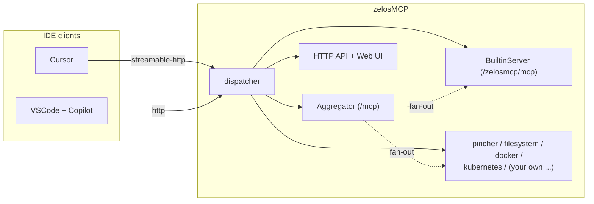

# zelosMCP


> Named for **Zelos**, the Greek personification of zeal and rivalry — brother of Nike (victory) and Bia (force) and one of the four winged enforcers who stood beside Zeus. zelosMCP enforces a single contract across many MCP backends.

Wrap one or more MCP servers and re-expose them on stable URLs. One Cursor or VSCode entry today, a cluster-wide router tomorrow.

zelosMCP runs a single web server that fronts any number of MCP servers — stdio commands, SSE endpoints, or Streamable HTTP URLs. Each one gets a fixed local address (`http://localhost:8000/<name>/mcp`), and a bare `http://localhost:8000/mcp` aggregates tools, prompts, and resources from every running backend under a `<server>__<tool>` namespace. Plus a comprehensive Cursor / Copilot rule generator, a live tool catalog UI, and a small REST control plane.

## Quickstart

If you have Docker available:

```bash
make init-env       # optional one-time wizard: writes .env (USER_DATA_ROOT, ports, etc.)
make up             # build image (if missing) + start container + load default backends
```

That's it. `make up` is idempotent — re-running on a healthy container just re-applies the config. Skip `make init-env` if you're happy with defaults; the Makefile falls back to them.

Open [http://localhost:8000](http://localhost:8000) for the web UI, then wire your IDE — see [docs/quickstart.md](docs/quickstart.md) for Cursor and VSCode + Copilot snippets and the dynamic rule-file generator.

Don't have Docker? See [docs/quickstart-no-docker.md](docs/quickstart-no-docker.md) for the Python pip install path.

## Architecture in 60 seconds



Three things to know:

- **`/<name>/mcp`** is a raw passthrough to one backend (original tool names).
- **`/mcp`** aggregates every running backend (names prefixed `<server>__`). This is what your IDE should connect to.
- **`/zelosmcp/mcp`** is an always-on built-in MCP that exposes self-introspection tools — `zelosmcp__generate_cursor_rule`, `zelosmcp__get_aggregated_tool_catalog`, etc. — so the agent can drive zelosMCP itself.

Deeper dive (component table, dispatcher flow, aggregator fan-out, lifespan sequence): [docs/architecture.md](docs/architecture.md).

## Future direction: Kubernetes-hosted MCP proxy + router

zelosMCP starts as a developer-local proxy/aggregator (one Cursor or VSCode entry, many backends), but the same dispatcher + reverse-proxy + aggregator surface is deliberately built to run as a shared Kubernetes service:

- **Multi-tenant routing.** The Cursor-compatible config schema (see [docs/configuration.md](docs/configuration.md)) already supports any number of stdio / SSE / streamable-HTTP backends per process, with per-backend reverse-proxy mounts and bearer-token injection. A team can deploy zelosMCP as a single in-cluster Service that fans out to managed MCP backends running as sidecars or sibling pods.
- **Cluster-side backends.** The `kubernetes` and `docker` MCP backends already shipped with zelosMCP (see [docs/default-mcps.md](docs/default-mcps.md)) are the precedent — both are designed to operate against an in-cluster API. A hosted zelosMCP deployment can offer them centrally instead of asking every developer to mount `/var/run/docker.sock` and a kubeconfig locally.
- **Stable HTTP surface.** `/<name>/mcp`, `/mcp`, `/zelosmcp/mcp`, and the `/api/*` REST control plane are all plain HTTP — they ingress through any standard cluster ingress / service-mesh layer without protocol gymnastics.
- **Observability + savings.** The token-savings dashboard ([docs/dashboard.md](docs/dashboard.md)) and SSE log stream make a hosted deployment auditable per-team. The persistent SQLite store can be swapped for any aiosqlite-compatible path via `ZELOSMCP_SAVINGS_DB`, including a PVC-backed file or a sidecar database.

Concrete in-cluster manifests are not yet published — the goal of this README is to document the local quickstart while flagging that the same code will be packaged as a Helm chart / operator in a follow-up release.

## Documentation

| Topic | Doc |
|---|---|
| Architecture deep-dive | [docs/architecture.md](docs/architecture.md) |
| Quickstart (5 minutes, Cursor or VSCode) | [docs/quickstart.md](docs/quickstart.md) |
| Rancher Desktop setup (Docker daemon + kubeconfig) | [docs/setup-rancher-desktop.md](docs/setup-rancher-desktop.md) |
| Makefile reference + volume-mount customization | [docs/makefile.md](docs/makefile.md) |
| `mcpServers` config schema and `/api/start` lifecycle | [docs/configuration.md](docs/configuration.md) |
| Reverse-proxy backend HTTP sidecars under zelosMCP's port | [docs/reverse-proxy.md](docs/reverse-proxy.md) |
| Tool-list compression (`get_tool_schema` / `invoke_tool` wrappers) | [docs/compression.md](docs/compression.md) |
| Default MCP backends (pincher + filesystem mandatory; docker / kubernetes default) | [docs/default-mcps.md](docs/default-mcps.md) |
| Repositories panel (discover git repos + write rules + index in pincher) | [docs/repositories.md](docs/repositories.md) |
| Cursor integration + dynamic `.mdc` rule generation | [docs/cursor-integration.md](docs/cursor-integration.md) |
| VSCode + GitHub Copilot integration + `copilot-instructions.md` | [docs/vscode-integration.md](docs/vscode-integration.md) |
| Built-in MCP at `/zelosmcp/mcp` + `/catalog` page | [docs/built-in-mcp.md](docs/built-in-mcp.md) |
| HTTP API reference (`/api/*` and the MCP routes) | [docs/http-api.md](docs/http-api.md) |
| Assets framework (rules, extensions, agents, hooks) | [docs/assets.md](docs/assets.md) |

Plus the interactive Swagger UI at [http://localhost:8000/docs](http://localhost:8000/docs) and ReDoc at [http://localhost:8000/redoc](http://localhost:8000/redoc).

## Project structure

```
pyproject.toml              # Package definition
Dockerfile                  # Upstream community-friendly image (no corp cert handling)
Makefile                    # Build + lifecycle targets
configs/
  default-zelosmcp.json     # Project-agnostic default backend set
  default-volumes.conf      # Default container volume mounts (host paths + named volumes)
docker-tools/               # Cert-aware build infrastructure (corporate proxy environments)
  Dockerfile                # Multi-stage: base-os -> extra-os -> zelosmcp
  buildx.Dockerfile         # Cert-aware buildkit builder image
  README.md                 # Build flow + Makefile pointers
docs/                       # All documentation (this README links into it)
src/zelosmcp/
  __init__.py
  __main__.py               # python -m zelosmcp
  app.py                    # Starlette app, ASGI dispatcher, OpenAPI routes
  aggregator.py             # Aggregator: union of tools/prompts at /mcp
  builtin.py                # Always-on built-in MCP at /zelosmcp/mcp + rule generator
  compression.py            # tool-list compression wrappers (get_tool_schema/invoke_tool)
  config.py                 # Cursor-compatible config parser + ServerSpec
  docs.py                   # in-app /api/docs markdown viewer
  manager.py                # ProxyManager: many ProxyStates + the aggregator
  proxy.py                  # ProxyState: single backend lifecycle + MCP forwarding
  savings.py                # per-call token-savings recorder
  savings_db.py             # SQLite store backing the savings dashboard
  ui.py                     # Web UI (single-page HTML/CSS/JS)
scripts/
  init_env.py               # interactive .env wizard (`make init-env`)
tests/                      # pytest suite (no Docker required)
```

## Enterprise / corporate-proxy deploy

If you're behind a TLS-intercepting corporate proxy (e.g. Palo Alto), the upstream `Dockerfile` won't get past the proxy on its `apt`/`pip`/`npm`/`uvx` calls. The [`docker-tools/`](docker-tools/) directory holds a cert-aware multi-stage build for that case, and the [`Makefile`](Makefile) wires up the full lifecycle — see [docs/makefile.md](docs/makefile.md) and [docs/setup-rancher-desktop.md](docs/setup-rancher-desktop.md) for the cert export, build, and run sequence.

## Contributing / hacking

```bash
pip install -e .
PYTHONPATH=src .venv/bin/python -m pytest tests/ -q
```

The test suite covers the dispatcher, aggregator fan-out, in-memory built-in transport, rule generator (both `cursor-mdc` and `copilot-instructions` formats), config parsing, and per-server lifecycle. CI-friendly — no Docker daemon required.

For the Python (non-Docker) install path see [docs/quickstart-no-docker.md](docs/quickstart-no-docker.md).
