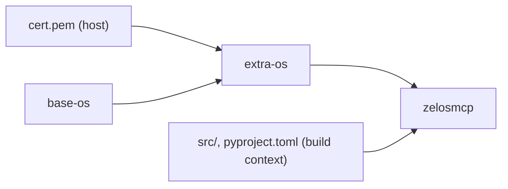

# `docker-tools/`

Nike enterprise build infrastructure for the zelosMCP container image. Adds corporate-root-authority-cert handling to the multi-stage build so `apt`, `pip`, `npm`, and `uvx` can clear Nike's TLS-intercepting proxy (Palo Alto) at image-build time.

The community-friendly upstream [`Dockerfile`](../Dockerfile) at the repo root is left untouched and remains usable for non-enterprise environments.

## Contents

| Path | Purpose |
|---|---|
| [`Dockerfile`](Dockerfile) | Multi-stage build with corporate cert handling. Stages: `base-os` -> `extra-os` -> `zelosmcp`. |
| [`buildx.Dockerfile`](buildx.Dockerfile) | Custom `buildx` builder image. Pre-loads the corporate cert so the buildkit daemon can pull base images through the corporate proxy. |
| `cert.pem` | The corporate root authority certificate exported from the macOS keychain. Generated by `make get-corp-root-authority-cert`; gitignored. Required at build time by stages that run `apt` / `pip` / `npm`. |

## Build flow

The `extra-os` stage runs `update-ca-certificates` after copying the cert in, so every stage that depends on it (currently just `zelosmcp`) trusts the corporate proxy without further setup. Adding new stages on top: branch off `extra-os` for anything that needs network at build time.

## Usage

The full target list is in [`../Makefile`](../Makefile). Targets that drive this directory:

| Target | What it does |
|---|---|
| `make get-corp-root-authority-cert` | Exports `docker-tools/cert.pem` from the macOS keychain. CN is parameterized via `CORP_ROOT_AUTHORITY_CERT_NAME` (default `Nike Root Authority NG`). |
| `make build-buildx-image` | Builds the corp-cert-aware `buildx` builder image (`zelosmcp-buildx`). Called by `setup-buildx`. |
| `make setup-buildx` | Creates the `zelosmcp-builder` buildx instance using `buildx.Dockerfile`. |
| `make build` | Builds the zelosMCP image (target `zelosmcp`) and loads it into the local Docker daemon as `zelosmcp:dev`. |
| `make rebuild` | Same with `--no-cache`. Use when zelosmcp's `pyproject.toml` deps change or you want to pick up new commits on the same branch. |

After build, the zelosMCP container is run via `make up` (which uses the resulting image, not anything in this directory). See the [main Makefile](../Makefile) for the full lifecycle.

## Why this is separate from the upstream Dockerfile

The upstream [`Dockerfile`](../Dockerfile) at the repo root works fine in environments without TLS-intercepting proxies - it just calls `apt`, `curl`, `pip` directly against public registries. Nike's environment requires that the corporate root CA be installed and trusted before any of those network calls succeed; this directory's `Dockerfile` handles that prerequisite, then layers in everything the upstream Dockerfile does.

If your environment doesn't need cert injection, use the upstream Dockerfile + `docker build -t zelosmcp .` directly. If it does, use this directory's tooling.
