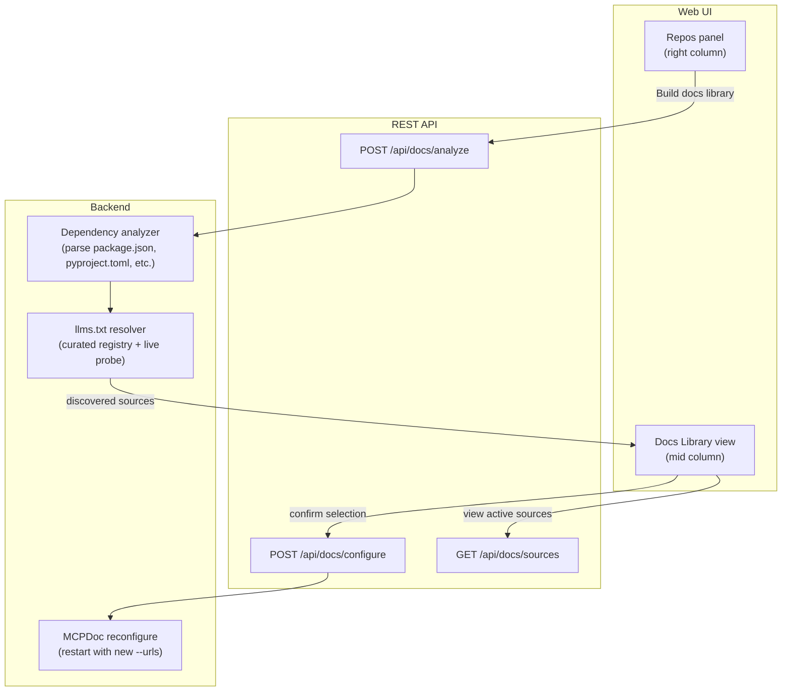
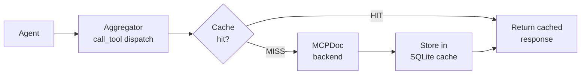
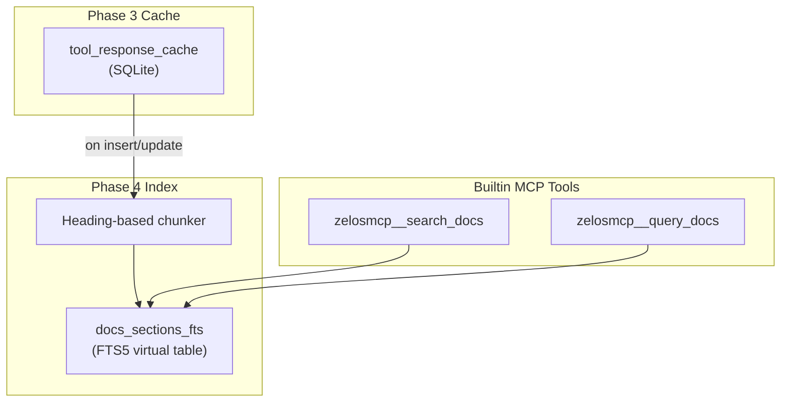

# Docs Integration into zelosMCP: MCPDoc + Auto-Discovery

## Context

**zelosMCP** is a Python/Starlette ASGI app that wraps multiple MCP servers behind a single HTTP surface. It aggregates tools at `/mcp`, has a web UI with left-nav view switching, a REST control plane at `/api/*`, a SQLite-backed asset framework for rule playbooks/extensions, and runs in Docker with stdio-launched MCP backends.

**MCPDoc** ([langchain-ai/mcpdoc](https://github.com/langchain-ai/mcpdoc)) is a lightweight MCP server from LangChain that exposes `llms.txt` documentation to agents via two tools: `list_doc_sources` and `fetch_docs`. It has 4 dependencies, a 13 KB wheel, zero local state, and built-in domain access controls. MIT license, ~1K GitHub stars, backed by LangChain.

**Pincher** already handles local project docs via its `corpus=docs` FTS5 index -- indexing markdown, searching with BM25, and returning token-budget-aware responses. That capability is out of scope for this plan.

This plan has two phases:
1. **MVP** -- Register MCPDoc as a stdio backend so agents can fetch external documentation from sites that publish `llms.txt`
2. **Moonshot** -- Auto-analyze a project's dependencies, discover which have `llms.txt`, and configure docs sources through the UI

---

## Phase 1: MVP -- MCPDoc as an MCP backend

### Goal

Agents connected to zelosMCP can call `mcpdoc__list_doc_sources` and `mcpdoc__fetch_docs` through the aggregator at `/mcp` to retrieve external documentation from curated `llms.txt` sources.

### 1a. Install MCPDoc in the Docker image

In [Dockerfile](Dockerfile), add `pipx install mcpdoc` alongside the existing `pipx ensurepath` step:

```dockerfile
RUN pip install --no-cache-dir uv pipx \
 && pipx ensurepath \
 && pipx install mcpdoc
```

MCPDoc is 13 KB with 4 deps (httpx, markdownify, mcp, pyyaml) -- three of which zelosMCP already uses. Negligible image size impact.

### 1b. Register MCPDoc in the default config

Add a `mcpdoc` entry to [configs/default-zelosmcp.json](configs/default-zelosmcp.json) under `mcpServers`:

```json
"mcpdoc": {
  "command": "uvx",
  "args": [
    "--from", "mcpdoc", "mcpdoc",
    "--urls",
    "LangGraph:https://langchain-ai.github.io/langgraph/llms.txt",
    "LangChain:https://python.langchain.com/llms.txt",
    "--transport", "stdio"
  ],
  "started": false,
  "compress": {
    "level": "low"
  }
}
```

`started: false` makes it opt-in. The `--urls` list is a starter set; Phase 2 makes this dynamic. Compression level `low` keeps schemas legible (only 2 tools).

The aggregator will surface tools as `mcpdoc__list_doc_sources` and `mcpdoc__fetch_docs` at `/mcp`.

### 1c. Create asset YAML for MCPDoc

Create [configs/assets/mcpdoc.yaml](configs/assets/mcpdoc.yaml) following the pattern in [configs/assets/pincher.yaml](configs/assets/pincher.yaml):

- **rules.tool_instructions**: per-tool guidance explaining the `llms.txt` workflow (list sources -> pick relevant URLs -> fetch)
- **agents**: a "Docs researcher" subagent skill that chains `list_doc_sources` then `fetch_docs` for relevant pages

The asset YAML should encode the MCPDoc workflow pattern that LangChain recommends in their README -- list sources, read the index, reflect on the query, fetch relevant pages.

### 1d. Curate a starter `llms.txt` URL registry

Create a data file (Python dict or JSON) mapping popular packages/frameworks to their known `llms.txt` URLs. This serves as both the default `--urls` list for the MCPDoc config and as the lookup table for Phase 2's auto-discovery.

Start with frameworks most relevant to zelosMCP users:

```python
KNOWN_LLMS_TXT: dict[str, str] = {
    "langgraph": "https://langchain-ai.github.io/langgraph/llms.txt",
    "langchain": "https://python.langchain.com/llms.txt",
    "fastapi": "https://fastapi.tiangolo.com/llms.txt",
    "react": "https://react.dev/llms.txt",
    # ... expanded iteratively
}
```

This registry is the foundation for Phase 2 and can grow independently of code changes.

### 1e. Verify MCPDoc starts and tools appear in the aggregator

Smoke-test that the full chain works before committing Phase 1 complete:

1. **Start mcpdoc manually** using the exact `command` + `args` from the config entry added in 1b. Confirm it launches without errors and responds to an MCP `initialize` handshake over stdio.
2. **Start zelosMCP** (or run the integration test harness) with mcpdoc's `started` flipped to `true`. Confirm:
   - `mcpdoc` appears in the dashboard's server list with status "running"
   - The aggregator at `/mcp` exposes `mcpdoc__list_doc_sources` and `mcpdoc__fetch_docs` in its `tools/list` response
3. **Call both tools through the aggregator**:
   - `mcpdoc__list_doc_sources` returns the URL list from the `--urls` config
   - `mcpdoc__fetch_docs` with one of the starter URLs returns markdown content
4. **Reset `started` back to `false`** in the committed config (opt-in default).

If any step fails, fix it before moving to Phase 2. This is the definition of "Phase 1 done".

---

## Phase 2: Moonshot -- Auto-discover and configure docs sources

### Goal

A user clicks a repo in the Repositories panel, clicks "Build docs library", and zelosMCP auto-discovers the project's dependencies, identifies which have `llms.txt`, and configures MCPDoc with the relevant URLs -- all with feedback in the UI.

### Architecture



### 2a. Dependency analyzer module

Create [src/zelosmcp/docs_analyze.py](src/zelosmcp/docs_analyze.py) that reads a project's dependency files through the read-only mount and extracts package names:

- `package.json` -> npm packages (dependencies + devDependencies)
- `pyproject.toml` / `requirements.txt` / `setup.cfg` -> Python packages
- `go.mod` -> Go modules
- `Cargo.toml` -> Rust crates

Each parser is a small function; no new dependencies needed (zelosMCP already has `pyyaml` for TOML-adjacent parsing; `json` is stdlib; `requirements.txt` is line-based).

### 2b. `llms.txt` resolver

The resolver takes a list of package names and returns which have known `llms.txt` URLs:

1. **Curated registry lookup** -- check the registry from Phase 1d (instant, no network)
2. **Live probe** (optional, gated behind a flag) -- for unknown packages, attempt `HEAD` request to common docs URL patterns + `/llms.txt` (e.g., `https://<pkg>.readthedocs.io/llms.txt`, `https://docs.<pkg>.dev/llms.txt`). Cache results to avoid repeated probes.

The live probe is opt-in because it makes network requests. Default behavior is curated-registry-only (offline, deterministic).

### 2c. API endpoints

Add to [src/zelosmcp/app.py](src/zelosmcp/app.py):

- `POST /api/docs/analyze` -- takes `{"repo": "<name>"}`, runs the analyzer + resolver, returns:

```json
{
  "repo": "zelosmcp",
  "dependencies": [
    {"name": "starlette", "ecosystem": "python", "llms_txt": "https://www.starlette.io/llms.txt", "status": "known"},
    {"name": "mcp", "ecosystem": "python", "llms_txt": null, "status": "no_llms_txt"},
    {"name": "httpx", "ecosystem": "python", "llms_txt": "https://www.python-httpx.org/llms.txt", "status": "known"}
  ]
}
```

- `GET /api/docs/sources` -- returns the currently configured MCPDoc `llms.txt` URLs (reads from the running mcpdoc backend's config or from persisted state)

- `POST /api/docs/configure` -- takes `{"urls": {"LangGraph": "https://...", ...}}`, restarts the mcpdoc backend with the new `--urls` list. Uses the existing `manager.stop_one` / `manager.start_one` pattern with a dynamically constructed `ServerSpec`.

### 2d. UI: "Docs Library" view + repo panel integration

Add a new left-nav entry and view section in [src/zelosmcp/ui.py](src/zelosmcp/ui.py), following the existing view pattern:

**Left nav** (under a new "Knowledge" nav-group between "Dashboards" and "Authentication"):

```html
<div class="nav-group">
  <div class="nav-group-label">Knowledge</div>
  <button type="button" class="nav-item" data-view="docs-library">Docs library</button>
</div>
```

**Mid-column view** (`data-view="docs-library"`):
- Table of currently configured `llms.txt` sources with name, URL, and domain
- "Add source" form: name + `llms.txt` URL input, validates the URL resolves
- "Remove" button per source
- Changes call `POST /api/docs/configure` and restart the mcpdoc backend

**Repos panel integration** (right column):
- "Build docs library" extension button on each repo row (defined in the mcpdoc asset YAML with `targets: [repos_row]`)
- Clicking calls `POST /api/docs/analyze`, shows an inline panel listing discovered deps with `llms.txt` availability
- Checkboxes per dep, "Add selected" button that merges into the active MCPDoc config via `POST /api/docs/configure`

### 2e. Persist docs source configuration

Store the user's configured `llms.txt` URL set so it survives container restarts. Options (in order of preference):

1. **Asset store** -- store as a `docs_sources` asset row in the existing SQLite asset DB. Matches the existing persistence pattern and requires no new storage.
2. **Env-var override** -- `ZELOSMCP_MCPDOC_URLS` as a semicolon-delimited list. Simple but doesn't support UI-driven changes.

Recommend option 1. The `POST /api/docs/configure` endpoint writes to the asset store and restarts mcpdoc with the persisted URLs on next boot.

---

## Phase 3 (Future): Aggregator response cache

### Goal

Eliminate redundant network fetches by caching MCPDoc (and any other backend) tool responses in SQLite. Transparent to both agents and backends -- neither knows the cache exists.

### Architecture



### 3a. Cache store

Add a `tool_response_cache` table to the existing savings SQLite DB (or a dedicated `~/.zelosmcp/cache.sqlite`):

```sql
CREATE TABLE tool_response_cache (
    cache_key   TEXT PRIMARY KEY,   -- SHA-256 of (backend, tool_name, canonical_args)
    backend     TEXT NOT NULL,
    tool_name   TEXT NOT NULL,
    args_hash   TEXT NOT NULL,
    response    BLOB NOT NULL,      -- serialized CallToolResult
    created_at  REAL NOT NULL,      -- unix timestamp
    expires_at  REAL NOT NULL,      -- created_at + ttl
    hit_count   INTEGER DEFAULT 0
);
```

### 3b. Aggregator cache integration

In `aggregator.py`, wrap the `call_tool` dispatch with a cache check. The cache is opt-in per backend via a new `cache` block in the server config:

```json
"mcpdoc": {
  "command": "uvx",
  "args": ["--from", "mcpdoc", "mcpdoc", "--urls", "..."],
  "cache": {
    "ttl_seconds": 86400,
    "max_entries": 10000
  }
}
```

Backends without a `cache` block are not cached. The cache key is deterministic: `SHA-256(backend + tool_name + json.dumps(args, sort_keys=True))`.

### 3c. Cache management API

- `GET /api/cache/stats` -- hit rate, entry count, total size, per-backend breakdown
- `POST /api/cache/purge` -- clear all or per-backend (`{"backend": "mcpdoc"}`)
- `DELETE /api/cache/entry` -- remove a specific cached response by URL or key

### 3d. Expected impact

For a shared gateway with 10 agents working on similar stacks:

- First fetch of a docs page: ~200-2000ms (network)
- Subsequent fetches within TTL: <5ms (SQLite read)
- Storage: ~50-500 KB per cached page; 10K entries = ~5-50 MB total
- Hit rate for docs pages: expected 70-90% (agents repeatedly consult the same reference pages)

---

## Phase 4 (Future): FTS5 search over cached docs

### Goal

Once the cache has accumulated fetched docs pages, index them with FTS5 so agents can search across all cached documentation with BM25 ranking and token-budgeted responses -- matching pincher's efficiency for external docs.

### Architecture



### 4a. Docs chunker

When a page is cached (Phase 3), also chunk it by markdown heading structure and insert sections into an FTS5 virtual table:

```sql
CREATE VIRTUAL TABLE docs_sections_fts USING fts5(
    title,
    heading_path,
    body,
    source_url UNINDEXED,
    backend UNINDEXED,
    cached_at UNINDEXED
);
```

Each section is a heading + its content until the next heading of equal or higher level. Same semantic chunking strategy that pincher uses for `corpus=docs`.

### 4b. Builtin search tools

Add two new tools to `builtin.py`:

- **`search_docs`** -- BM25 search across all cached+indexed external docs. Returns ranked sections within a token budget. Similar to pincher's `search` with `corpus=docs` but scoped to external docs.
- **`query_docs`** -- natural language query that returns a compact context pack (top sections, heading paths, source URLs, token estimate). Same shape as what docmancer's `query` would have returned, but built on zelosMCP's own index.

These surface at `/mcp` as `zelosmcp__search_docs` and `zelosmcp__query_docs`.

### 4c. Pre-warming

When the "Build docs library" moonshot (Phase 2) configures new `llms.txt` sources, optionally pre-fetch and cache the pages listed in each `llms.txt` index. This populates the FTS5 index so `search_docs` returns results immediately rather than waiting for agents to organically fetch pages.

### 4d. Expected impact

- Agent no longer needs to read `llms.txt` index and guess which pages to fetch -- it searches directly
- Token efficiency: BM25-ranked sections within a budget (e.g., 2400 tokens) vs. full 4K-token pages
- Cross-source search: query "authentication middleware" and get results from React, FastAPI, and LangChain docs in one call
- Progressive improvement: the index gets richer as agents fetch more pages over time

---

## Key design decisions

- **MCPDoc over docmancer**: MCPDoc is stateless (zero storage footprint), legally clean (`llms.txt` is explicit opt-in by the docs site), backed by LangChain, and trivially replaceable. Docmancer adds 560 MB of models, a Qdrant binary lifecycle, scraping concerns, and pre-1.0 instability risk for marginal benefit over pincher + MCPDoc combined.

- **No scraping**: The integration only fetches from URLs listed in `llms.txt` files. The site has explicitly opted in to machine consumption by publishing `llms.txt`. No robots.txt concerns, no ToS violations.

- **Zero gateway storage for docs**: MCPDoc is stateless -- no indexes, no databases, no per-user storage growth. The only persisted state is the URL configuration list (a few KB in the asset store). This scales cleanly in a shared gateway model.

- **Pincher handles local docs**: Pincher's `corpus=docs` FTS5 index already covers the "index this project's local docs" use case. This plan focuses exclusively on external docs discovery and access.

- **`started: false` in default config**: MCPDoc is opt-in. The "Build docs library" UI workflow or manual start via the dashboard activates it when needed.

- **Dynamic reconfiguration**: MCPDoc's `--urls` args are set at process start. Changing sources requires restarting the mcpdoc backend. This is a sub-second operation (mcpdoc has no startup cost) and uses the existing `stop_one` / `start_one` manager pattern.

---

## Rejected alternatives -- do not re-propose

These options were evaluated and explicitly rejected during planning. A future agent executing this plan should NOT revisit or re-propose them without the human explicitly asking.

### Rejected: docmancer as the docs integration tool

[docmancer](https://github.com/docmancer/docmancer) (PyPI: `docmancer`, v0.5.1) was the original candidate. It provides a full docs-RAG pipeline (SQLite FTS5 + Qdrant dense/sparse vectors + hybrid RRF fusion) and an MCP pack runtime. It was rejected for these reasons:

- **Pre-1.0, solo maintainer, 7 weeks old.** 31 releases in 48 days with breaking config changes between 0.4.x and 0.5.0. High instability risk.
- **560 MB model download** (FastEmbed) + 60 MB Qdrant binary. Bloats the Docker image and adds first-run latency.
- **Unbounded storage footprint.** Each docs index is 50-500 MB. In a shared gateway model with many users, storage grows without bound and has no eviction mechanism.
- **Web scraping concerns.** `docmancer add <url>` scrapes arbitrary URLs by default. This creates robots.txt and ToS violation risk. MCPDoc avoids this entirely by only fetching from `llms.txt` (explicit site opt-in).
- **Pincher already covers local docs.** Pincher's `corpus=docs` FTS5 index handles local markdown/text search with BM25 ranking and token-budgeted responses. Docmancer's local docs pipeline is redundant.
- **21 direct runtime dependencies** including qdrant-client, fastembed, pdfplumber, trafilatura. Large transitive risk surface.

### Rejected: building an internal FTS5 docs-RAG service from scratch

An internal solution using SQLite FTS5 (already available via aiosqlite) was estimated at 1-3 days for a BM25-only MVP. It was rejected for Phase 1 because:

- **Pincher already does this.** Building an internal FTS5 index for local docs duplicates what pincher's `corpus=docs` already provides.
- **MCPDoc is simpler for external docs.** For the `llms.txt` use case, MCPDoc is a one-line config entry vs. building an ingestion pipeline, chunker, and query engine.
- **Deferred, not canceled.** Phase 4 of this plan adds FTS5 indexing over cached MCPDoc responses as a future enhancement, built on zelosMCP's own infrastructure.

### Rejected: building fetch_llms_txt as a zelosMCP builtin tool

Adding `llms.txt` fetch tools directly to `builtin.py` (~50-100 lines) instead of depending on MCPDoc was considered. It would eliminate the external dependency but was deferred because:

- **MCPDoc is trivially small** (13 KB, 4 deps that zelosMCP already has). The dependency risk is minimal.
- **MCPDoc has built-in domain allowlisting** with per-source scoping. Rebuilding this correctly (especially the security boundary for local vs. remote `llms.txt` files) adds scope.
- **MCPDoc is easily replaceable later.** If LangChain abandons it, the builtin approach is a clean fallback that takes a few hours to build at that point.

### Rejected: general web scraping for docs sites without llms.txt

~87-95% of websites do not publish `llms.txt`. General web scraping would cover more docs sources but was rejected because:

- **Legal risk.** robots.txt and Terms of Service violations. Many docs sites explicitly prohibit automated scraping even if robots.txt allows it.
- **Rate limiting and IP blocking.** Shared gateway = many agents = high fetch volume = likely blocked.
- **Complexity.** Headless browser rendering, JS-heavy site handling, anti-bot bypasses. Massive scope increase.
- **The `llms.txt` gap narrows over time.** Developer documentation sites are the primary adopters of `llms.txt`. As adoption grows, the gap matters less.

---

## Codebase patterns for the executing agent

These are the specific patterns to follow when implementing. Read the referenced files before writing code.

### Adding a stdio MCP backend

Reference: [configs/mandatory-zelosmcp.json](configs/mandatory-zelosmcp.json) and [configs/default-zelosmcp.json](configs/default-zelosmcp.json). A stdio backend entry has `command`, `args`, optional `env`, optional `compress`, optional `started`. The config is parsed in [src/zelosmcp/config.py](src/zelosmcp/config.py) `_parse_server` which detects stdio by the presence of `command`.

### Adding asset YAML

Reference: [configs/assets/pincher.yaml](configs/assets/pincher.yaml). Structure: `backend: <name>`, `seed_version: N`, then `rules:`, `extensions:`, `agents:` sections. The seeder in [src/zelosmcp/framework/assetstore/seeder.py](src/zelosmcp/framework/assetstore/seeder.py) reads these at startup. Each registered kind in [src/zelosmcp/framework/assetstore/kinds/](src/zelosmcp/framework/assetstore/kinds/) has a `parse_section` function.

### Adding API routes

Reference: any `async def api_*` handler inside `create_app()` in [src/zelosmcp/app.py](src/zelosmcp/app.py). Handlers are nested functions that close over `manager`. Register in the `routes=[...]` list. Add OpenAPI docstring. Return `JSONResponse`. For request bodies, use `await request.json()` with validation.

### Adding UI views

Reference: [src/zelosmcp/ui.py](src/zelosmcp/ui.py). The left nav uses `<button class="nav-item" data-view="name">` elements. Mid-column views are `<section class="view" data-view="name">` elements. View switching is handled by existing JS that toggles `.active` class. All HTML/CSS/JS is inline in the `HTML_TEMPLATE` string.

### Adding to the Dockerfile

Reference: [Dockerfile](Dockerfile). Python tools are installed via `pip` or `pipx` in the runtime stage. The `pipx ensurepath` step already exists. New pipx installs go on the same `RUN` line.

### Test patterns

Reference: [tests/conftest.py](tests/conftest.py) for `patch_proxy_deps()`, `make_mock_session()`, `FakeResult`. Integration tests use `httpx.ASGITransport(app=create_app(ProxyManager(mandatory_config_path="")))`. All tests are async (`asyncio_mode = "auto"` in `pyproject.toml`).

---

## Files to create or modify

- `Dockerfile` -- Add `pipx install mcpdoc` (Phase 1)
- `configs/default-zelosmcp.json` -- Add `mcpdoc` server entry (Phase 1)
- `configs/assets/mcpdoc.yaml` -- Asset YAML: rules, agent (Phase 1)
- `src/zelosmcp/docs_analyze.py` -- New: dependency analyzer + llms.txt resolver + curated registry (Phase 2)
- `src/zelosmcp/app.py` -- Add `/api/docs/*` routes (Phase 2)
- `src/zelosmcp/ui.py` -- Add "Docs library" nav item + view section + repo panel integration (Phase 2)
- `tests/test_docs_analyze.py` -- Tests for dependency analyzer and resolver (Phase 2)
- `tests/test_docs_api.py` -- Tests for API endpoints (Phase 2)

---

## Guardrails

These rules apply to every step of implementation. Violating any of them is a hard stop -- fix before continuing.

### Git discipline

- **Never push to a remote.** All work stays local until the human explicitly pushes.
- **Small local commits after every atomic change.** One commit per sub-task (e.g. "1a: Dockerfile", "1b: default config entry"). Each commit must leave the tree in a passing state.
- **Conventional commit messages.** Format: `feat(docs): <short description>` or `test(docs): ...`. Reference the phase/step in the body when useful.
- **No force pushes, no rebases, no amends** unless explicitly requested.
- **Never commit secrets, `.env` files, or credentials.** Check staged files before every commit.

### Test-driven development

- **Write the test first.** For every new function, route, or behavior, the failing test exists before the production code.
- **Run the full test suite after every change.** `pytest tests/` must pass (exit 0) before committing. If pre-existing tests break, fix them or confirm the breakage is intentional and document why.
- **Match existing test patterns.** Use `httpx.ASGITransport` + `create_app(ProxyManager(mandatory_config_path=""))` for integration tests; `patch_proxy_deps()` from `conftest.py` for unit tests. Async tests use `asyncio_mode = "auto"` (already configured in `pyproject.toml`).
- **No mocking of the code under test.** Mock external boundaries (subprocess, network, filesystem) only.

### Code quality

- **Match the existing style exactly.** No new linters, formatters, or import conventions that differ from what the codebase already does.
- **No unnecessary comments.** Comments explain non-obvious intent, not what the code does.
- **No new dependencies without justification.** If a stdlib or already-installed package covers the need, use it. New PyPI deps require a note in the commit message explaining why.
- **Run linter checks on every edited file.** Fix introduced errors before committing; do not fix pre-existing lints unless they block the change.

### Scope and safety

- **One phase at a time.** Complete and commit all of Phase 1 before starting Phase 2. Do not mix phases in a single commit.
- **Do not modify unrelated code.** If a refactor would improve something outside the docs integration, note it in a comment or TODO but do not change it in this branch.
- **Preserve backward compatibility.** Existing configs, API responses, and MCP tool surfaces must not change behavior. The mcpdoc backend is additive only.
- **Fail loudly on misconfiguration.** Follow the existing `ConfigError` pattern -- missing env vars, bad paths, and invalid args raise at parse/startup time, not silently at runtime.
- **No network calls during tests.** All subprocess and HTTP interactions in tests must be mocked or use in-process fakes.
- **Pincher is out of scope.** Do not modify pincher configuration, pincher asset YAML, or pincher-related code.

### Documentation

- **Update this plan file** as tasks are completed (check off items in the task checklist below).
- **Do not create new markdown docs** unless explicitly requested. The plan file is the single source of truth for this feature branch.

---

## Task checklist

### Phase 1: MVP -- MCPDoc backend
- [x] 1a: Add MCPDoc installation to Dockerfile
- [x] 1b: Add mcpdoc MCP server entry to configs/default-zelosmcp.json
- [x] 1c: Create configs/assets/mcpdoc.yaml with rule playbooks and agent definitions
- [x] 1d: Create curated llms.txt URL registry (Python data file)
- [ ] 1e: Verify mcpdoc stdio backend starts and tools appear in aggregator

### Phase 2: Moonshot -- Auto-discovery UI
- [ ] 2a: Create src/zelosmcp/docs_analyze.py with dependency parsers
- [ ] 2b: Add llms.txt resolver (curated registry lookup + optional live probe)
- [ ] 2c: Add /api/docs/* REST endpoints to app.py
- [ ] 2d: Persist docs source configuration in asset store
- [ ] 2e: Add "Docs library" view to ui.py
- [ ] 2f: Add "Build docs library" repo panel integration to ui.py

### Phase 3 (Future): Aggregator response cache
- [ ] 3a: Add tool_response_cache SQLite table and cache store module
- [ ] 3b: Integrate cache check/store into aggregator call_tool dispatch
- [ ] 3c: Add cache config block to ServerSpec parsing in config.py
- [ ] 3d: Add /api/cache/* management endpoints
- [ ] 3e: Surface cache stats in savings dashboard UI

### Phase 4 (Future): FTS5 search over cached docs
- [ ] 4a: Add heading-based docs chunker and docs_sections_fts virtual table
- [ ] 4b: Add zelosmcp__search_docs and zelosmcp__query_docs builtin tools
- [ ] 4c: Add pre-warming logic to "Build docs library" workflow
- [ ] 4d: Surface indexed docs stats in "Docs library" UI view
