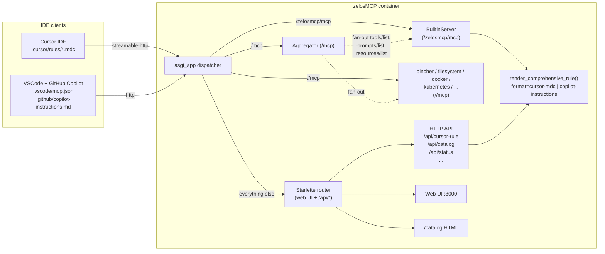
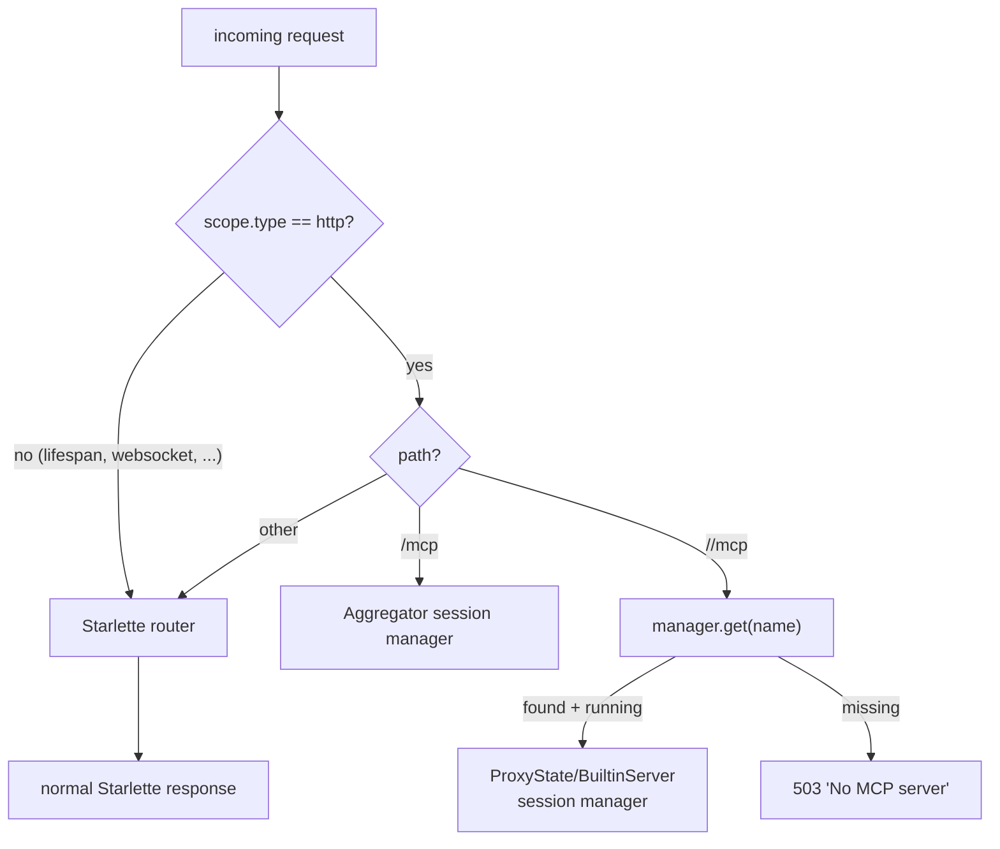
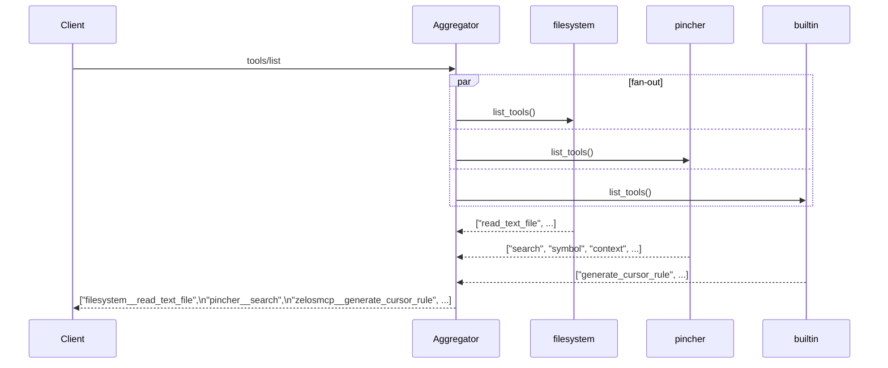
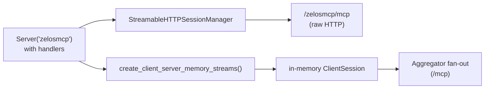
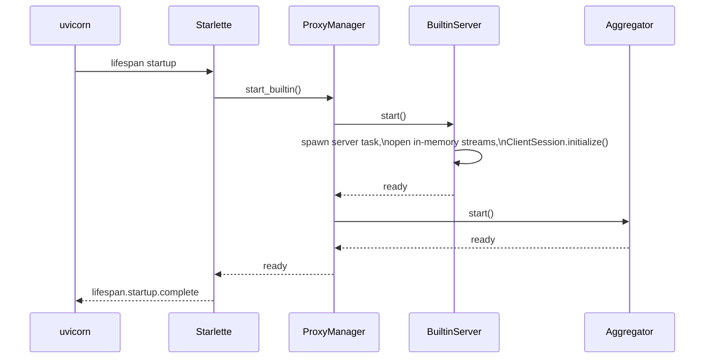
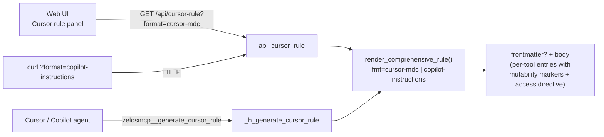

# Architecture

zelosMCP is a single ASGI app that fronts many MCP backends behind one stable URL. It exposes:

- a per-backend raw-passthrough endpoint at `http://localhost:8000/<name>/mcp`
- an aggregate endpoint at `http://localhost:8000/mcp` that unions tools/prompts/resources from every running backend
- an always-on in-process built-in MCP at `http://localhost:8000/zelosmcp/mcp` that exposes self-introspection tools
- a web UI, REST control plane (`/api/*`), and an HTML tool catalog (`/catalog`)

This page covers the components, the request flow, and how IDE clients (Cursor, VSCode + Copilot) integrate.

## Big picture

A single Starlette `lifespan` hook starts the built-in before traffic arrives, and `POST /api/start` orchestrates user backends afterward.

## Components

| Component | File | Role |
|---|---|---|
| `asgi_app` dispatcher | [src/zelosmcp/app.py](../src/zelosmcp/app.py) | Routes `/mcp`, `/zelosmcp/mcp`, `/<name>/mcp` to the right MCP session manager. Everything else hits the standard Starlette router. |
| `ProxyManager` | [src/zelosmcp/manager.py](../src/zelosmcp/manager.py) | Owns one `ProxyState` per configured backend plus the always-on `BuiltinServer` and the `Aggregator`. Drives `/api/start` / `/api/stop` / per-server lifecycle. |
| `ProxyState` | [src/zelosmcp/proxy.py](../src/zelosmcp/proxy.py) | One per user backend. Spawns the backend (stdio subprocess or remote URL), wraps it in a `ClientSession`, and re-exposes its MCP surface via a `StreamableHTTPSessionManager` at `/<name>/mcp`. |
| `Aggregator` | [src/zelosmcp/aggregator.py](../src/zelosmcp/aggregator.py) | Owns `/mcp`. Fans `tools/list` / `prompts/list` / `resources/list` / `resources/templates/list` across every running backend's `client_session` in parallel; prefixes tool/prompt names with `<server>__`; routes `tools/call` / `prompts/get` / `resources/read` back to the originating backend. |
| `BuiltinServer` | [src/zelosmcp/builtin.py](../src/zelosmcp/builtin.py) | Always-on, in-process MCP at `/zelosmcp/mcp`. Same shape as `ProxyState` but driven by an in-memory client/server pair via [`mcp.shared.memory.create_client_server_memory_streams`](https://github.com/modelcontextprotocol/python-sdk/blob/main/src/mcp/shared/memory.py). Exposes `zelosmcp__generate_cursor_rule`, `zelosmcp__list_loaded_servers`, `zelosmcp__get_aggregated_tool_catalog`, etc. |
| Web UI | [src/zelosmcp/ui.py](../src/zelosmcp/ui.py) | Single-page app at `/`. Live status, click-to-expand tool catalog per server row, Cursor `mcp.json` snippets, the Cursor rule (`.mdc`) panel with read-only / read-write toggle. Plus `/catalog` standalone documentation page. |

## What the dispatcher does

For `/<name>/mcp`, the dispatcher rewrites `scope["path"]` to `/mcp` before handing off, so the backend's session manager sees the path it expects.

The [`BuiltinServer`](../src/zelosmcp/builtin.py) is registered as `manager.servers["zelosmcp"]` — same lookup as user backends — so the dispatcher routes `/zelosmcp/mcp` to it without special-casing.

## Aggregator fan-out

When a single client (Cursor or Copilot) hits `/mcp`, the aggregator orchestrates parallel calls to every running backend's `ClientSession`:

For `tools/call` the aggregator splits the `<server>__` prefix back off and forwards to the matching backend.

For `resources/read` it consults a `URI -> backend` cache populated as a side effect of `resources/list`; for URIs never previously listed (e.g. constructed from a template), it falls back to fan-out — first successful backend wins and is cached.

Capability mismatches (`-32601 Method not found` from a backend that doesn't implement, say, `prompts/list`) are silently skipped.

| Method | At `/mcp` | At `/<name>/mcp` |
|---|---|---|
| `tools/list`, `tools/call` | Aggregated; names prefixed `<server>__…` | Raw passthrough |
| `prompts/list`, `prompts/get` | Aggregated; names prefixed `<server>__…` | Raw passthrough |
| `resources/list`, `resources/templates/list` | Aggregated; URIs unchanged (origin tracked for routing reads) | Raw passthrough |
| `resources/read` | Routed to the originating backend (cache hit) with fan-out fallback | Raw passthrough |
| `resources/subscribe` / `unsubscribe` | **Not** aggregated (server-initiated notifications aren't relayed currently) | Raw passthrough |

## How the built-in MCP plugs in

The built-in server is structurally identical to a `ProxyState`: it has `name`, `running`, `error`, `session_manager`, `client_session`, `backend_info`, `subscribe_logs` / `unsubscribe_logs`, `start` / `stop`. The dispatcher and aggregator iterate `manager.servers.values()` blindly — they don't know it's special.

What's different is its transport: rather than spawning a subprocess or dialing a URL, it wires a single `mcp.server.lowlevel.Server` instance to two transports:

That's why `zelosmcp__*` tools also surface at `/mcp`: the aggregator fan-out hits the in-memory client just like any other backend.

## Lifespan-driven startup

After this, `/zelosmcp/mcp` and `/mcp` are both live before any HTTP request arrives, even when no user backend has been configured yet. `POST /api/start` later starts user backends in parallel and bounces the aggregator to pick them up.

`stop_all` (called by `POST /api/stop` or the lifespan shutdown) tears down user backends + aggregator but **deliberately preserves the built-in** so that `/zelosmcp/mcp` stays available across config reloads.

## Cursor + VSCode integration

Both IDEs are MCP clients. They speak streamable-HTTP to zelosMCP and consume the same aggregator. Their MCP-config files differ slightly:

| | Cursor | VSCode + Copilot |
|---|---|---|
| Top-level key | `mcpServers` | `servers` |
| HTTP transport `type` | `streamable-http` | `http` |
| Workspace config path | `.cursor/mcp.json` | `.vscode/mcp.json` |
| User config | `~/.cursor/mcp.json` | Command Palette → `MCP: Open User Configuration` |
| Rule / instructions file | `.cursor/rules/*.mdc` (YAML frontmatter) | `.github/copilot-instructions.md` (plain markdown) |

Both IDEs are wired up identically: a single MCP config entry pointing at `http://localhost:8000/mcp` gives the agent every tool from every backend. The agent-instructions file (Cursor `.mdc` or Copilot `copilot-instructions.md`) is generated dynamically by `GET /api/cursor-rule` — the `?format=` query param swaps the wrapper between the two IDEs.

See [cursor-integration.md](cursor-integration.md) and [vscode-integration.md](vscode-integration.md) for the per-IDE setup walkthroughs.

## Where to read more

- [quickstart.md](quickstart.md) — get up and running in five minutes.
- [configuration.md](configuration.md) — the `mcpServers` config schema zelosMCP accepts.
- [default-mcps.md](default-mcps.md) — what the default backends do (mandatory `pincher` and `filesystem`; default-config `kubernetes` and `docker`) and what mounts they need.
- [repositories.md](repositories.md) — the right-column Repositories panel and `/api/repos` endpoints (discover git repos under `/user_data_ro`, write rules, index in pincher).
- [built-in-mcp.md](built-in-mcp.md) — the always-on `/zelosmcp/mcp` and its tools.
- [http-api.md](http-api.md) — full reference for `/api/*` and the MCP routes.
- [makefile.md](makefile.md) — every Make target, including the volumes-config customization.
