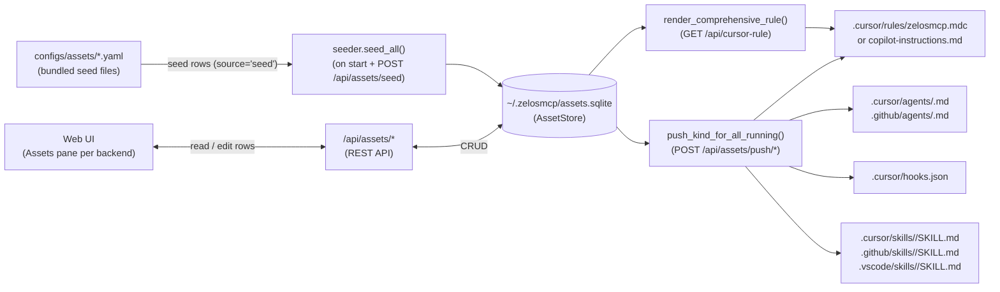

# Assets framework

An **asset** is a named piece of content stored in zelosMCP's SQLite database that extends its behavior for a specific MCP backend. Assets can be Cursor rule playbooks, UI action buttons (extensions), agent definitions (agents), skill definitions (skills), or Cursor hook entries. They are seeded from `configs/assets/*.yaml` at startup, persisted in `~/.zelosmcp/assets.sqlite`, and exposed for editing through the web UI and HTTP API.

The database-backed model means you can customise rule playbooks, add per-backend extension buttons, define agent personas, register domain-knowledge skills, or register Cursor hooks — and those changes survive restarts. The bundled YAML files provide sensible defaults; your edits are never silently overwritten.

## Data flow

## Kinds at a glance

| Kind | YAML section key | GUI tab | Pushable | Written to |
|---|---|---|---|---|
| `rule` | `rules:` | Rules | Yes | `.cursor/rules/zelosmcp.mdc` and/or `.github/copilot-instructions.md` |
| `extension` | `extensions:` | Extensions | No (runs in UI) | — invokes an MCP tool or opens a link |
| `agent` | `agents:` | Agents | Yes | `.cursor/agents/<name>.md`, `.github/agents/<name>.md` |
| `hook` | `hooks:` | Hooks | Yes (merge) | `.cursor/hooks.json` |
| `skill` | `skills:` | Skills | Yes | `.cursor/skills/<slug>/SKILL.md`, `.github/skills/<slug>/SKILL.md`, `.vscode/skills/<slug>/SKILL.md` |

Extensions are the only non-pushable kind — they render as UI buttons and trigger live MCP tool calls or open links rather than writing files.

## Seed vs user rows

Every row in the asset store carries a `source` field:

- **`source='seed'`** — written by the built-in seeder from a `configs/assets/*.yaml` file. The seeder will overwrite seed rows only when the YAML file has a higher `seed_version` than the stored row.
- **`source='user'`** — written via the web GUI or `PUT /api/assets/{kind}/{backend}/{name}`. The seeder **never** overwrites user rows regardless of `seed_version`.

This means customising a playbook via the Assets pane is safe: your changes persist across restarts and image upgrades. To restore the bundled default, use the **Revert to seed** button in the edit modal (which deletes the user row) and then reload.

## Environment variables

| Variable | Default | Purpose |
|---|---|---|
| `ZELOSMCP_ASSETS_DB` | `~/.zelosmcp/assets.sqlite` | SQLite path for the asset store. Pass `:memory:` to keep rows in-process only (resets on restart). |
| `ZELOSMCP_ASSETS_DIR` | auto-discovered `configs/assets/` | Directory of seed YAML files. The seeder walks upward from its source file to find `configs/assets/`, then checks `/app/configs/assets` and `/opt/zelosmcp/configs/assets` before falling back to a cwd-relative path. |

## See also

- [asset-kinds.md](asset-kinds.md) — per-kind reference for `rule`, `extension`, `agent`, and `hook`, including schema fields, YAML examples, push behavior, and validation rules.
- [assets-yaml.md](assets-yaml.md) — the unified per-backend YAML format: top-level fields, `seed_version` upsert semantics, schema validator, file-discovery order, and worked examples.
- [assets-editor.md](assets-editor.md) — web UI walkthrough: the Assets pane, YAML editor with live lint, comprehensive push buttons, and the Execute extensions section.
- [assets-api.md](assets-api.md) — HTTP API reference for all `/api/assets/*` endpoints.
