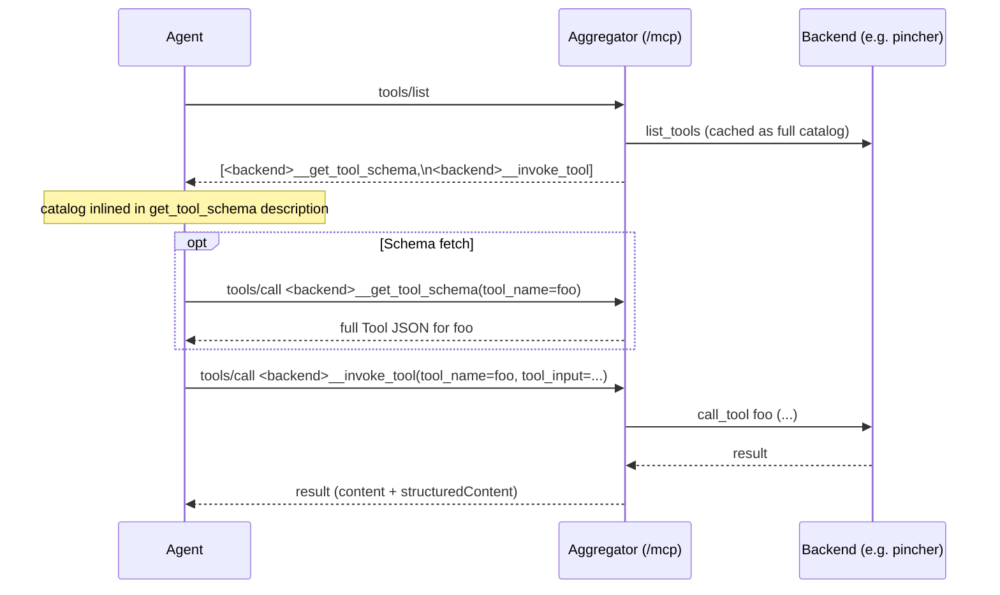

# Tool-list compression

LLMs see every MCP tool's full description and JSON schema in `tools/list`. With several backends loaded that easily means 15-25 KB of tokens **before** the conversation starts. LocalMCP's optional `compress` block on each backend swaps a backend's full tool surface for a small two-tool wrapper pair, slashing the schema-fetch token cost without losing functionality.

The agent flow becomes a two-step lookup:

1. The model sees `<backend>__get_tool_schema(tool_name)` and `<backend>__invoke_tool(tool_name, tool_input)` instead of N raw tools. Each wrapper's description embeds a compact catalog (one short line per underlying tool) so the model can browse without paying schema-fetch latency on every name.
2. When the model wants to use a tool, it calls `get_tool_schema(...)` to fetch the full schema for that one tool, then `invoke_tool(...)` to run it.

For very large backends, level=`max` collapses the wrapper pair into a single `list_tools()` call — even the inlined catalog goes away from `tools/list`.

> Inspired by [atlassian-labs/mcp-compressor](https://github.com/atlassian-labs/mcp-compressor) (their compressed mode). LocalMCP implements the same idea natively in the aggregator instead of running mcp-compressor as a subprocess in front of each backend.

## Schema

Add a `compress` block to any `mcpServers.<name>` entry:

```json
"kubernetes": {
  "command": "npx",
  "args": ["-y", "kubernetes-mcp-server@latest"],
  "compress": {
    "level": "medium",
    "scope": "aggregator"
  }
}
```

| Field | Required | Type | Default | Notes |
|---|---|---|---|---|
| `level` | no | string | `"medium"` | One of `"low"`, `"medium"`, `"high"`, `"max"`. Controls how aggressively the catalog is summarised. |
| `scope` | no | string | `"aggregator"` | One of `"catalog"`, `"aggregator"`, `"global"`. Controls which endpoints surface the wrappers (vs. the full tool list). |

An empty `"compress": {}` block is fine — it expands to the defaults.

## Levels

| Level | What `tools/list` shows for the compressed backend |
|---|---|
| `low` | Full tool list, full descriptions. No compression on the wire — but the catalog cache is still populated for [the discovery tool](#discovery-tool). |
| `medium` (default) | Wrapper pair (`get_tool_schema` + `invoke_tool`) whose description embeds `- name: first-sentence` per tool. |
| `high` | Wrapper pair whose description embeds `- name(arg1, arg2, ...)` per tool — names + parameter names only, no descriptions. |
| `max` | A single `list_tools` wrapper. The model has to call it explicitly to discover what's available. Use for backends with hundreds of rarely-used tools. |

The pincher backend at `level=medium` typically goes from ~5KB of tool descriptions in `tools/list` to ~600 bytes — about a 90% reduction. Kubernetes-mcp-server (~19 tools, verbose schemas) compresses similarly.

## Scopes

| `scope` | `/<name>/mcp` (raw passthrough) | `/mcp` (aggregator) | Discovery tools / cursor-rule generator |
|---|---|---|---|
| `catalog` | full uncompressed surface | full uncompressed surface | compressed |
| `aggregator` (default) | full uncompressed surface | wrappers only | compressed |
| `global` | wrappers only | wrappers only | compressed |

The discovery / cursor-rule paths always see the compressed catalog when `compress` is set, regardless of scope — they're documentation surfaces, not wire formats. `catalog` mode means "the wire stays exactly as it is today; only docs / agent-instructions get compressed."

### When to pick which scope

- **`catalog`** — you want the cursor rule and `localmcp__list_compressed_tools` to render compactly, but every direct MCP client connecting to the aggregator or to `/<name>/mcp` should see the full schema. Useful when you've curated the agent rule body but don't want to change the wire format for ad-hoc clients.
- **`aggregator`** (default, recommended) — agents going through the aggregator at `/mcp` (the typical Cursor / Claude Desktop / Copilot setup) see the compressed pair. Direct connections to a single backend at `/<name>/mcp` keep the full surface (useful for debugging, scripts that already know the backend's API).
- **`global`** — you have clients that connect directly to `/<name>/mcp` and you want them to see the compression too. Both endpoints serve wrappers.

## Agent-side flow

For a backend at `level=medium, scope=aggregator`, the agent's experience at `/mcp`:

1. **Discover.** `tools/list` returns `<backend>__get_tool_schema` and `<backend>__invoke_tool`. The `get_tool_schema` tool's description contains the full catalog of underlying tool names with one-sentence summaries — enough for the model to choose.
2. **Schema fetch (optional).** If the model needs more than the catalog, it calls `<backend>__get_tool_schema(tool_name="foo")`. Returns the JSON-serialised `Tool` object for `foo`.
3. **Invoke.** `<backend>__invoke_tool(tool_name="foo", tool_input={...})`. Result content + `structuredContent` are forwarded verbatim — any `outputSchema` validation in the underlying tool still passes.



## Discovery tool

The always-on built-in MCP exposes a `localmcp__list_compressed_tools` tool that returns the compressed catalog as JSON for any backend with `compress` configured — independent of scope:

- `backend` (optional string): limit to a single backend by name.
- `level` (optional string): re-render the catalog at a different level than what's configured. Useful for previewing what `level=high` would look like before changing the live config.

The same catalog feeds the cursor-rule generator (`/api/cursor-rule` and `localmcp__generate_cursor_rule`), so a backend at `scope=catalog` still gets a compressed rule body — that's the point.

## Defaults shipped with LocalMCP

The mandatory backends in [configs/mandatory-localmcp.json](../configs/mandatory-localmcp.json) ship with `compress: { level: "medium" }` (scope omitted, defaults to `aggregator`). The default-config kubernetes entry in [configs/default-localmcp.json](../configs/default-localmcp.json) does the same. Override per-backend by editing those files or POSTing your own config to `/api/start`.

To turn compression off for a specific backend, drop the `compress` block (it's optional) or set `level: "low"`.

## Token-savings sanity check

```bash
# Compressed (default mandatory + default config):
curl -sS -X POST http://localhost:8000/mcp \
    -H 'Accept: application/json, text/event-stream' \
    -d '{"jsonrpc":"2.0","id":1,"method":"tools/list","params":{}}' | wc -c

# Compare with all `compress` blocks removed from your config — typically
# 5-10x larger.
```

## See also

- [docs/configuration.md](configuration.md) — the parent `mcpServers` schema.
- [docs/default-mcps.md](default-mcps.md) — which backends ship with compression on by default.
- [docs/built-in-mcp.md](built-in-mcp.md) — the `localmcp__list_compressed_tools` discovery tool.
- [atlassian-labs/mcp-compressor](https://github.com/atlassian-labs/mcp-compressor) — design reference for the wrapper-tool pattern and level taxonomy.
