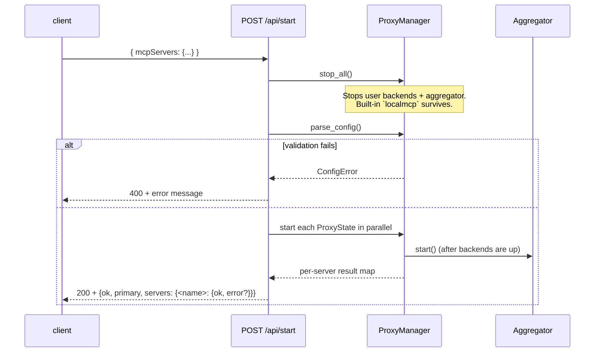

# Configuration

LocalMCP accepts the same `mcpServers` JSON shape Cursor uses in its own `mcp.json`. No extra fields are required. This page covers the schema, the three transport flavors, reserved names, and the `/api/start` lifecycle.

## Where the config goes

The config is **POST**-ed to `/api/start` — it's not a config file LocalMCP reads from disk on startup. There are two common ways to send it:

1. **Web UI** (`http://localhost:8000`) — paste into the Configuration textarea, click START.
2. **`make load`** — POSTs the file at `$(LOCALMCP_CONFIG)` (default: [`configs/default-localmcp.json`](../configs/default-localmcp.json)).
3. **`curl`**:

   ```bash
   curl -sS -X POST http://localhost:8000/api/start \
     -H 'Content-Type: application/json' \
     --data-binary @path/to/your-config.json
   ```

The state lives in memory. Restart the LocalMCP container and you'll need to re-POST.

## Schema

Top-level shape:

```json
{
  "mcpServers": {
    "<name>": { ... },
    "<name>": { ... }
  }
}
```

`<name>` becomes the URL segment for that backend's raw passthrough endpoint (`/<name>/mcp`) and the prefix Cursor sees on aggregated tool names (`<name>__<tool>`). Names must match `[A-Za-z0-9][A-Za-z0-9_\-.]*` and not collide with [reserved names](#reserved-names).

Per-server fields are discriminated by which keys are present:

### Stdio (`command`)

For an MCP server you spawn as a subprocess. Discriminated by the **presence of `command`**.

```json
{
  "filesystem": {
    "command": "npx",
    "args": ["-y", "@modelcontextprotocol/server-filesystem", "/user_data_rw"],
    "env": { "DEBUG": "true" },
    "cwd": "/user_data_rw"
  }
}
```

| Field | Required | Type | Notes |
|---|---|---|---|
| `command` | yes | string | Executable. Searched on `PATH` inside the LocalMCP container. |
| `args` | no | array of strings | Arguments. Default `[]`. |
| `env` | no | object of strings | Extra env vars merged into the subprocess's environment. |
| `cwd` | no | string | Working directory for the subprocess. |

### SSE (`type: "sse"`)

For a remote MCP server speaking Server-Sent-Events. Discriminated by `type`.

```json
{
  "linear": {
    "type": "sse",
    "url": "https://mcp.linear.app/sse",
    "headers": { "Authorization": "Bearer ..." }
  }
}
```

| Field | Required | Type | Notes |
|---|---|---|---|
| `type` | yes | `"sse"` | Discriminator. |
| `url` | yes | string | Full URL of the SSE endpoint. |
| `headers` | no | object of strings | Sent on the SSE connection. |

### Streamable HTTP (`type: "streamable-http"`)

For a remote MCP server speaking the streamable-HTTP transport (the same transport LocalMCP itself uses).

```json
{
  "github": {
    "type": "streamable-http",
    "url": "https://api.githubcopilot.com/mcp/",
    "headers": { "Authorization": "Bearer $GITHUB_TOKEN" }
  }
}
```

| Field | Required | Type | Notes |
|---|---|---|---|
| `type` | yes | `"streamable-http"` | Discriminator. |
| `url` | yes | string | Full URL of the MCP endpoint. |
| `headers` | no | object of strings | Sent on every request. |

### Reverse-proxy (`reverseProxy`)

Any backend (stdio or remote) can declare an optional `reverseProxy` block alongside the transport fields above. When set, LocalMCP forwards HTTP requests on the configured `mount` path to the backend's HTTP sidecar — letting you expose a dashboard or REST API through LocalMCP's port without leaking the backend's own port.

```json
"pincher": {
  "command": "pincher",
  "args": ["--data-dir", "/tmp/pincher", "--http", "127.0.0.1:8080", "--trust-proxy"],
  "reverseProxy": {
    "mount": "/pincher",
    "upstream": "http://127.0.0.1:8080"
  }
}
```

| Field | Required | Type | Notes |
|---|---|---|---|
| `mount` | yes | string | URL prefix on LocalMCP, e.g. `/pincher`. Must start with `/`, no trailing `/`. Cannot collide with reserved mounts. |
| `upstream` | yes | string | Backend HTTP sidecar URL. Recommend a loopback host. |
| `stripPrefix` | no | bool | Strip `mount` from the path before forwarding. Default `false`. |
| `headers` | no | object of strings | Extra request headers. Override auto-injected `X-Forwarded-*`. |
| `auth.bearer` | no | string | Bearer token to inject when caller has no `Authorization`. Supports `${ENV_VAR}` interpolation. |

See [reverse-proxy.md](reverse-proxy.md) for the full reference, including the canonical `X-Forwarded-*` set, network-isolation pattern, and pincher worked example.

### Compression (`compress`)

Any backend can declare an optional `compress` block. When set, LocalMCP swaps the backend's full tool surface (N tools, each with descriptions and JSON schemas) for a small wrapper pair — `<backend>__get_tool_schema` and `<backend>__invoke_tool` — slashing tokens spent on `tools/list`. Wrappers stay invocable; the agent fetches a tool's full schema on demand via `get_tool_schema(tool_name)` and runs it via `invoke_tool(tool_name, tool_input)`.

```json
"kubernetes": {
  "command": "npx",
  "args": ["-y", "kubernetes-mcp-server@latest"],
  "compress": {
    "level": "medium",
    "scope": "aggregator"
  }
}
```

| Field | Required | Type | Default | Notes |
|---|---|---|---|---|
| `level` | no | string | `"medium"` | One of `"low"`, `"medium"`, `"high"`, `"max"`. `low` keeps full descriptions; `max` collapses to a single `list_tools` wrapper. |
| `scope` | no | string | `"aggregator"` | One of `"catalog"`, `"aggregator"`, `"global"`. Controls which endpoints surface the wrappers vs. the full tool list. |

Quick scope reference:

| `scope` | `/<name>/mcp` | `/mcp` (aggregator) | docs / cursor-rule |
|---|---|---|---|
| `catalog` | full | full | compressed |
| `aggregator` (default) | full | wrappers | compressed |
| `global` | wrappers | wrappers | compressed |

See [compression.md](compression.md) for the full reference, level comparison, agent-side flow, and worked examples.

## Reserved names

A handful of `<name>` values collide with built-in HTTP routes; LocalMCP rejects them with a `ConfigError`:

| Name | Why |
|---|---|
| `mcp` | Aggregator endpoint at `/mcp`. |
| `api` | Control plane at `/api/*`. |
| `docs`, `redoc`, `openapi.json`, `openapi` | API docs at `/docs`, `/redoc`, `/openapi.json`. |
| `static` | Reserved for future static-asset routes. |
| `localmcp` | The always-on built-in MCP at `/localmcp/mcp`. |

Names are matched case-insensitively. Pick a different name (e.g. `local-tools` instead of `localmcp`) if you really need that string.

## Deprecated `primaryMCP`

Older configs include a top-level `primaryMCP` field naming a single backend to mirror at `/mcp`. As of v0.3, `/mcp` always aggregates every running server, so `primaryMCP` is parsed for backward compatibility but ignored — a one-line deprecation warning is logged when present. Drop it from new configs.

## Lifecycle

`POST /api/start` runs:



Per-backend failures don't abort the whole request — each is reported in the per-server result map. The aggregator still starts as long as **any** backend is up; you can fix the broken entries and re-POST.

## Per-server lifecycle endpoints

Beyond bulk replace via `/api/start`, individual backends can be toggled:

| Endpoint | Effect |
|---|---|
| `POST /api/servers/<name>/start` | Start a single (already-configured) backend. |
| `POST /api/servers/<name>/stop` | Stop a single backend without affecting the others. |
| `GET /api/servers/<name>` | One-server slice of `/api/status`. |

These all refuse `<name> == "localmcp"` (the built-in is always-on and not toggleable).

## Common errors

| Error message | Cause |
|---|---|
| `Server name '<x>' is reserved (collides with a built-in route)` | Pick a different name. |
| `Server name '<x>' is invalid: use letters, digits, '-', '_', or '.'` | Naming pattern violation. |
| `Server '<x>': could not determine transport. Provide 'command' (stdio) or 'type' set to 'sse' or 'streamable-http'.` | Missing `command` and `type` keys. |
| `Server '<x>': '<field>' must be ...` | Type mismatch on a field. |
| `Duplicate server name (case-insensitive): '<x>'` | Two entries with names that case-fold to the same string. |

All of these come back as 400-status JSON: `{"ok": false, "error": "<message>"}`.

## See also

- [default-mcps.md](default-mcps.md) — what the default backends do (mandatory `pincher` and `filesystem`; default-config `kubernetes` and `docker`).
- [repositories.md](repositories.md) — Repositories UI panel and `/api/repos*` endpoints (write rules into discovered repos, index them in pincher).
- [reverse-proxy.md](reverse-proxy.md) — full reference for the optional `reverseProxy` block.
- [compression.md](compression.md) — full reference for the optional `compress` block.
- [http-api.md](http-api.md) — full HTTP API reference for `/api/start` and friends.
- [makefile.md](makefile.md) — `make load LOCALMCP_CONFIG=...` to push your own config.
