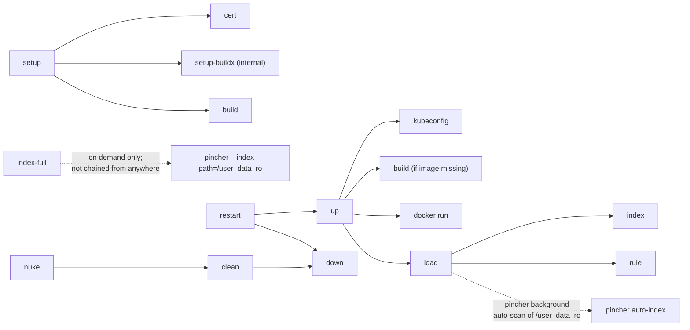

# Makefile reference

The [`Makefile`](../Makefile) wraps the Docker container lifecycle: image build, container start/stop, config load, pincher index warm-up, Cursor `.mdc` rule generation, and teardown. Verbs orchestrate sub-steps, so the typical user types one command per intent.

```bash
make help     # list every public verb with one-line descriptions
make init-env # interactive wizard, writes .env (optional one-time)
make up       # build (if missing) + start + load + index + rule
```

## Verbs by section

`make help` groups verbs into three sections that mirror the tables below: **control** (lifecycle), **service** (interact with the running container), and **development / debugging** (image build, environment setup, diagnostics).

### Control (lifecycle)

| Verb | Chains | Intent |
|---|---|---|
| `make up` | `kubeconfig` → ensure-image → start-container → `load` | "Get me running." Single command after `make init-env` (or even without it). Image auto-builds when missing. `load` chains `index` and `rule`. |
| `make down` | stop container | "Stop everything." |
| `make restart` | `down` → `up` | Bounce + reload config. |
| `make clean` | `down` → remove image + builder | Tear down everything except persistent volumes. |
| `make nuke` | `clean` → remove `localmcp-*` volumes | Reset to factory state. Pincher re-indexes from scratch on next `make up`. |

### Service (interact with the running container)

| Verb | Chains | Intent |
|---|---|---|
| `make load` | POST `LOCALMCP_CONFIG` → `index` (if `LOCALMCP_WARM_ON_LOAD=1`) → `rule` (if `LOCALMCP_RULE_ON_LOAD=1`) | Push backend config without restarting the container. Typical use: after editing `configs/default-localmcp.json`. |
| `make status` | container probe + HTTP probes | Quick "is it healthy?" check. |
| `make tools` | aggregator `tools/list` grouped by backend | Confirm what's exposed after `load`. |
| `make rule` | regenerate `LOCALMCP_RULE_FILE` | Refresh the Cursor `.mdc`. Auto-chained from `load`. |
| `make index` | force `pincher__index` of current repo | On-demand re-index of the active git repo. Auto-chained from `load`. |
| `make index-full` | force `pincher__index` of `/user_data_ro` | On demand only — **not** chained from anywhere. Pincher auto-scans the same path in the background after spawn. Use this when you want it now. |
| `make ui` | `open http://localhost:$LOCALMCP_PORT` | Opens the web UI in your browser. |
| `make kubeconfig` | add `localmcp` cluster + context to `$KUBERNETES_CONFIG_FILE` | Auto-called by `up`; exposed for manual re-add. |
| `make clean-kubeconfig` | remove `localmcp` cluster + context | Inverse of `kubeconfig`. |

### Development / debugging

| Verb | Chains | Intent |
|---|---|---|
| `make init-env` | run `scripts/init_env.py` | Interactive wizard, writes `.env` (and `configs/user-localmcp.json` when you opt out of any default backend). |
| `make setup` | `cert` → `setup-buildx` → `build` | One-shot first-time prep on a fresh machine. Slow (~3-5 min); idempotent. |
| `make build` | buildx build of `LOCALMCP_IMAGE_TAG` | Incremental image build. |
| `make rebuild` | buildx build with `--no-cache` | Force-rebuild after `pyproject.toml` deps change. |
| `make cert` | export corp root CA from macOS keychain | Only relevant behind a TLS-intercepting proxy; auto-called by `setup`. |
| `make logs` | `docker logs -f --tail=200` | Tail container logs. |
| `make shell` | `docker exec -ti $LOCALMCP_CONTAINER bash` | Bash inside the container. |
| `make vars` | print effective Make variable values | Quick check of what `.env` overrode. |

## Configuration via `.env`

The Makefile loads `.env` at the repo root via `-include .env`. Anything in `.env` overrides the defaults below. Two ways to populate it:

```bash
make init-env       # interactive wizard (recommended)
cp .env.example .env  # static template for manual editing
```

`make init-env` runs [`scripts/init_env.py`](../scripts/init_env.py): walks through the highest-impact knobs (USER_DATA_ROOT, port, bind address, Dockerfile choice, kubernetes/docker enable, Cursor rule scope/access mode), auto-detects `PLATFORM`, `DOCKER_SOCK_FILE`, and corp-cert presence, and writes a working `.env` end-to-end. When you opt out of any default backend, it also writes `configs/user-localmcp.json` (a subset of `configs/default-localmcp.json`) and points `LOCALMCP_CONFIG` at it.

| Variable | Default | Purpose |
|---|---|---|
| `USER_DATA_ROOT` | `$HOME/workspace` | Host directory bind-mounted twice: read-write at `/user_data_rw` (filesystem MCP root) and read-only at `/user_data_ro` (pincher index target / container WORKDIR). |
| `LOCALMCP_PORT` | `8000` | Container-internal port LocalMCP listens on. Published to the host via `-p $LOCALMCP_BIND_ADDR:$LOCALMCP_PORT:$LOCALMCP_PORT`. |
| `LOCALMCP_BIND_ADDR` | `127.0.0.1` | Host address the published port binds to. `127.0.0.1` (default) means only this Mac can reach `:8000`; `0.0.0.0` exposes it on the LAN. |
| `LOCALMCP_IMAGE_TAG` | `localmcp:dev` | Image tag the build produces. |
| `LOCALMCP_CONTAINER` | `localmcp` | Container name `make up` creates. |
| `LOCALMCP_CONFIG` | `configs/default-localmcp.json` | JSON config `make load` POSTs. |
| `LOCALMCP_VOLUMES_FILE` | `configs/default-volumes.conf` | List of `docker run -v` specs. See [Volume mounts](#volume-mounts). |
| `LOCALMCP_RULE_FILE` | `.cursor/rules/localmcp.mdc` | Where `make rule` writes the generated Cursor `.mdc`. Set to `$HOME/.cursor/rules/localmcp.mdc` for a global rule. |
| `LOCALMCP_RULE_ACCESS` | `read-write` | Tool access mode in the rule body. Set to `read-only` to forbid `[mutates]`/`[destructive]` tools. |
| `LOCALMCP_WARM_ON_LOAD` | `1` | Toggle the `load → index` chain. `0` for fast CI loads. |
| `LOCALMCP_RULE_ON_LOAD` | `1` | Toggle the `load → rule` chain. `0` to keep an existing hand-edited `.mdc` in place. |
| `KUBERNETES_CONFIG_FILE` | `$HOME/.kube/config` | Host kubeconfig bind-mounted read-only. `make up` adds a `localmcp` cluster + context to it via `kubectl config set-cluster/set-context`. See [setup-rancher-desktop.md](setup-rancher-desktop.md). |
| `DOCKER_SOCK_FILE` | `/var/run/docker.sock` | Host Docker socket bind-mounted at `/var/run/docker.sock`. Override to `~/.rd/docker.sock` for Rancher Desktop without admin access. |
| `DOCKERFILE` | `docker-tools/Dockerfile` | Build target. Set to `Dockerfile` if you're not behind a TLS-intercepting corporate proxy. |
| `PLATFORM` | `linux/arm64` | Target platform for buildx. `make init-env` auto-detects via `uname -m`. |
| `PINCHER_REPO` / `PINCHER_REF` | kmechlin fork + branch | Pincher source pinning (advanced; rarely overridden). |

Print effective values at any time with `make vars`.

### Ad-hoc one-off overrides

For one-shot overrides without touching `.env`:

```bash
make up USER_DATA_ROOT=/Users/me/code
make load LOCALMCP_CONFIG=configs/my-custom.json
make up LOCALMCP_BIND_ADDR=0.0.0.0
```

## Verb chain visualization



## Volume mounts (`LOCALMCP_VOLUMES_FILE`)

`make up` reads its `docker run -v` list from `$(LOCALMCP_VOLUMES_FILE)` (default [`configs/default-volumes.conf`](../configs/default-volumes.conf)). One mount per line. Comments allowed (`#…` to end of line). Blank lines ignored. Shell variables (`$HOME`, `$USER_DATA_ROOT`, `$KUBERNETES_CONFIG_FILE`, `$DOCKER_SOCK_FILE`) are expanded at runtime.

Default mounts wire up:

- `$KUBERNETES_CONFIG_FILE` → `/root/.kube/config` (read-only)
- `$USER_DATA_ROOT` → `/user_data_rw` (filesystem MCP root)
- `$USER_DATA_ROOT` → `/user_data_ro:ro` (pincher index target / container WORKDIR)
- `$DOCKER_SOCK_FILE` → `/var/run/docker.sock`
- Named volumes: `localmcp-npm` (npx cache), `localmcp-cache` (uv/pip cache), `localmcp-pincher` (pincher SQLite DB), `localmcp-savings` (savings dashboard DB)

Named volumes survive `docker rm`, so caches/indexes don't have to be rebuilt on every restart. `make nuke` removes them; `make clean` keeps them.

To customize, copy and edit:

```bash
cp configs/default-volumes.conf ~/.config/localmcp-volumes.conf
# edit ~/.config/localmcp-volumes.conf — add lines like:
#   /Users/me/secrets/.aws:/root/.aws:ro
#   $HOME/.gitconfig:/root/.gitconfig:ro
#   localmcp-models:/opt/models
make up LOCALMCP_VOLUMES_FILE=~/.config/localmcp-volumes.conf
```

The format mirrors `docker run -v` exactly: `<host-path-or-named-volume>:<container-path>[:options]`.

> **Security note on `$DOCKER_SOCK_FILE`.** Mounting the Docker socket is effectively root-on-host — anyone who can call the `docker` MCP tools can spawn / kill / image-pull on your machine. Only mount on dev machines. To opt out, comment the line in your volumes conf and remove the `docker` backend from your loaded config (or run `make init-env` and answer "no" to `Enable docker access?`).

## Corp-cert / buildx detail

`make setup` chains `cert` (export the corporate root CA from your macOS keychain via `security find-certificate`) → `setup-buildx` (custom buildx builder image preloaded with the cert) → `build`. The full rationale and stage-by-stage build flow lives in [docker-tools/README.md](../docker-tools/README.md).

If you're not behind a TLS-intercepting proxy, set `DOCKERFILE=Dockerfile` in `.env` (or accept that default when `make init-env` detects the absence of the corp cert). The community `Dockerfile` skips the cert injection entirely.

## See also

- [setup-rancher-desktop.md](setup-rancher-desktop.md) — picking a Docker daemon, the kubeconfig + bridge networking flow, common gotchas.
- [configuration.md](configuration.md) — `mcpServers` config schema `make load` POSTs.
- [http-api.md](http-api.md) — REST endpoints the Makefile targets call internally.
