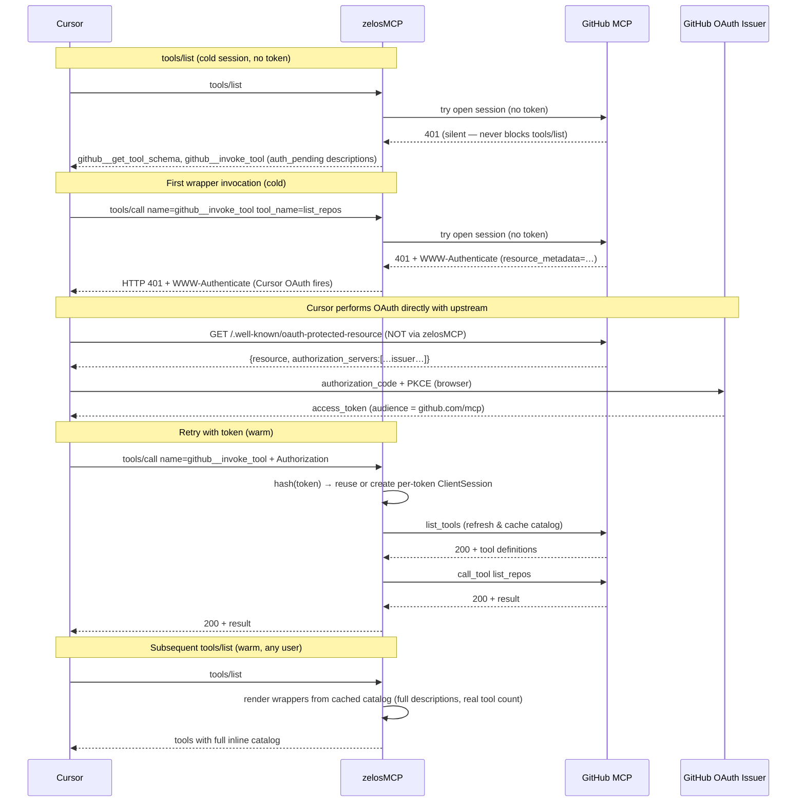

# OAuth Passthrough and Auth-Provider Broker

zelosMCP supports two complementary models for handing tokens to OAuth-protected upstream MCP servers (GitHub MCP, Atlassian MCP, etc.):

1. **Pure passthrough** (the original mode): zelosMCP forwards the inbound `Authorization` header verbatim and propagates 401 + `WWW-Authenticate` challenges back to the MCP client. The client (typically Cursor) does the OAuth dance directly with the upstream issuer.
2. **Broker mode** (the modern mode introduced alongside the GUI Connections page): zelosMCP itself runs the OAuth flow via the GUI, stores per-user tokens in an encrypted local SQLite store, and injects them on outbound requests. The aggregator HIDES the backend's wrapper tools from `tools/list` until the user authenticates — Cursor sees no entry for the backend at all until then.

The two modes coexist: you choose per-backend via the `auth` block in the server's mcpServers entry. Use broker mode when you want gated access plus per-user accounting; use pure passthrough when the upstream's OAuth flow already works through your MCP client (e.g. VS Code Copilot's GitHub MCP integration).

This page covers when to use each mode, how the broker's GUI device flow works end-to-end, the new two-file configuration split, and how to debug both.

## When to use which mode

| You want to … | Use |
|---|---|
| Gate a backend's wrappers behind successful auth in zelosMCP's GUI | **Broker mode** (`auth.provider`) |
| Forward whatever Authorization Cursor sent, no zelosMCP-side state | **Pure passthrough** (`passthrough: true`, no `auth.provider`) |
| Headless / CI deploys with a pre-issued token in env vars | **Static-bearer broker** (`auth.provider` -> a `static`-type provider) |
| Wire a remote MCP server that uses a static API token (legacy shape) | Plain `type: "streamable-http"` + `headers.Authorization` |
| Run a local stdio MCP subprocess | `command` + `args` |

Broker mode is what you want when:

- You're using Cursor (or any host without GitHub/Okta-specific OAuth registration); see GitHub's own [installation guide](https://github.com/github/github-mcp-server/blob/main/docs/installation-guides/install-cursor.md) noting Cursor is PAT-only for `api.githubcopilot.com/mcp/`.
- You need per-user accounting + audit (each user's token is stored separately, keyed by inbound Authorization hash).
- You want a UX where users complete a one-click browser handoff in zelosMCP's GUI rather than dealing with PAT generation.

Pure passthrough is still the right choice when the upstream's OAuth flow works natively in your MCP client (e.g. VS Code Copilot for GitHub MCP) and you don't need zelosMCP-side gating.

## End-to-end sequence

The aggregator at `/mcp` always emits the wrapper pair (`<backend>__get_tool_schema`, `<backend>__invoke_tool`) for every passthrough backend, **regardless of inbound auth state**. The first wrapper invocation drives the OAuth dance.



A few details worth calling out:

- **The wrapper pair is the OAuth entry point.** The agent never has to know the upstream's specific tool names ahead of time. It calls `<backend>__invoke_tool(tool_name=..., tool_input=...)`; if no session exists yet, the call returns 401 + WWW-Authenticate; Cursor opens the browser; the next call succeeds.
- **Cursor fetches `/.well-known/oauth-protected-resource` directly from the upstream**, not via zelosMCP. RFC 9728 §5.1 says clients MUST honor the `resource_metadata` URL in the `WWW-Authenticate` challenge — that URL points at the upstream, so zelosMCP doesn't need to serve any well-known endpoints itself.
- **The token is for the upstream resource.** Cursor requests a token for `https://api.githubcopilot.com/mcp/` (the `resource` field in the metadata). zelosMCP forwards it; the upstream validates its own `aud` claim. zelosMCP does not need OAuth client credentials of its own.
- **Catalog cache is shared across users.** The set of tools a backend exposes doesn't depend on the caller's identity (only the data they return does). Once any inbound user authenticates and warms the cache, every subsequent `tools/list` renders full wrapper descriptions — regardless of whether the *current* caller has a token.
- **Per-Cursor session isolation.** Sessions are keyed by SHA-256 of the inbound `Authorization`. Two Cursor instances with the same token share an upstream session (correct — same identity); different tokens get different sessions.

## Configuration: two files

zelosMCP splits auth-related configuration across two files with different sensitivity classes — convenient for k8s deploys where you want the server catalog in a `ConfigMap` and the provider definitions (with their env-resolved secret references) in a `Secret`.

| File | Owns | Loaded by | Mount point in container |
|---|---|---|---|
| [`configs/default-zelosmcp.json`](../configs/default-zelosmcp.json) | mcpServers catalog | `POST /api/start` (via `make load`) | `/etc/zelosmcp/mcp-servers.json` (k8s ConfigMap) |
| [`configs/auth-providers.json`](../configs/auth-providers.json) | Provider definitions | Lifespan auto-load (or `POST /api/auth/providers/config`) | `/etc/zelosmcp/auth-providers.json` (k8s Secret) |

The providers file's path is configurable via `ZELOSMCP_AUTH_PROVIDERS_FILE` (default: `configs/auth-providers.json` for local dev). Missing file is non-fatal — the registry stays empty and any backend with `auth.provider` set will fail-loud at `/api/start` with a clear message.

### Server entry shape (mcpServers catalog)

```json
{
  "mcpServers": {
    "github": {
      "type": "streamable-http",
      "url": "https://api.githubcopilot.com/mcp/",
      "passthrough": true,
      "auth": {
        "provider": "github_oauth_app"
      }
    }
  }
}
```

### Provider entry shape (auth-providers config)

```json
{
  "providers": {
    "github_oauth_app": {
      "type": "github_device_flow",
      "client_id": "${ZELOSMCP_GITHUB_CLIENT_ID}",
      "scopes": ["repo", "read:org", "user:email", "gist", "workflow"]
    },
    "nike_okta": {
      "type": "okta_device_flow",
      "issuer": "${ZELOSMCP_OKTA_ISSUER}",
      "client_id": "${ZELOSMCP_OKTA_CLIENT_ID}",
      "scopes": ["openid", "profile", "email"],
      "membership_hint": "${ZELOSMCP_OKTA_MEMBERSHIP_HINT}"
    }
  }
}
```

The `_doc` arrays in [`configs/auth-providers.json`](../configs/auth-providers.json) and [`configs/example-auth-providers.json`](../configs/example-auth-providers.json) document each field inline. Provider types currently supported:

- `github_device_flow` — public OAuth client against `github.com/login/device`. Requires `client_id`. Scopes optional.
- `okta_device_flow` — public OAuth client against an Okta tenant. Requires `issuer` + `client_id`. Optional `membership_hint` (UX-only string surfaced in the GUI as "Membership required: X" so users know which Okta authorized-group they need before hitting the consent screen).
- `passthrough` — wraps the legacy "forward Authorization verbatim" behaviour as an `AuthProvider`. No additional fields.
- `static` — wraps a configured bearer token (env-interpolated). Used for headless / CI deploys.

Per-backend `auth.provider` requires `passthrough: true` on the server entry — broker mode rewrites the outbound Authorization header per-request, which only works for passthrough HTTP backends.

Per-backend `auth.audience` is reserved for future token-exchange providers (RFC 8693). The current device-flow providers ignore it.

A copy-paste-ready full example pair sits at [`configs/example-passthrough-zelosmcp.json`](../configs/example-passthrough-zelosmcp.json) + [`configs/example-auth-providers.json`](../configs/example-auth-providers.json):

```bash
make load \
  ZELOSMCP_CONFIG=configs/example-passthrough-zelosmcp.json \
  ZELOSMCP_AUTH_PROVIDERS_FILE=configs/example-auth-providers.json
```

### Pool sizing for pure passthrough backends

```json
{
  "mcpServers": {
    "box": {
      "type": "streamable-http",
      "url": "https://mcp.box.com",
      "passthrough": true,
      "passthroughPool": {
        "maxSessions": 64,
        "idleTtlSeconds": 1800
      }
    }
  }
}
```

### Per-backend field reference

| Field | Type | Default | Notes |
|---|---|---|---|
| `passthrough` | bool | `false` | Enables passthrough mode. Requires `type: "streamable-http"`. |
| `auth.provider` | string | _(none)_ | Broker-mode provider name; must match a key in the providers config. Mutually exclusive with `auth.bearer`. |
| `auth.audience` | string | _(none)_ | Provider-specific audience claim; only valid alongside `auth.provider`. |
| `auth.bearer` | string | _(none)_ | LEGACY: Static fallback. Injected ONLY when the inbound request has no `Authorization`. Supports `${ENV_VAR}` interpolation. Prefer `auth.provider` -> a `static`-type provider for new configs. |
| `passthroughPool.maxSessions` | int | `64` | LRU cap on cached upstream sessions per backend. |
| `passthroughPool.idleTtlSeconds` | int | `1800` (30 min) | Idle TTL — sessions older than this since their last use are closed by the background sweeper. |

### Static fallback for headless / CI

The optional `auth.bearer` field is a useful escape hatch for environments where the OAuth dance can't run (CI, automation, machine accounts):

```json
{
  "github": {
    "type": "streamable-http",
    "url": "https://api.githubcopilot.com/mcp/",
    "passthrough": true,
    "auth": { "bearer": "${GITHUB_PAT}" }
  }
}
```

Behavior:

- If the inbound request has an `Authorization` header → that wins. The static bearer is **never** injected over a caller-supplied one.
- If the inbound has no `Authorization` AND `auth.bearer` is set → zelosMCP injects `Authorization: Bearer <auth.bearer>` on the outbound request.
- If neither → zelosMCP forwards without `Authorization` and lets the upstream challenge.

The static bearer is **redacted** in `/api/status` (`auth: {bearer: "***"}`) and never appears in logs.

## What constraints apply

- **Compression is the default.** Passthrough backends auto-apply `compress.scope=aggregator, level=medium` so the aggregator emits the wrapper pair on `tools/list` even when no caller has authenticated yet. To opt out (and revert to "invisible until auth" behaviour), set `"compress": null`. `"compress": {"scope": "global"}` is rejected at parse time — `/<name>/mcp` is a streaming reverse proxy, not a session manager, so wrappers can't be served at the per-backend mount.
- **`type: "sse"` and `command` are rejected.** Passthrough requires `type: "streamable-http"` and a `url`.
- **`tools/list` always succeeds and emits wrappers** for every passthrough backend with compression configured. With a valid token: real catalog inlined. With a previously-warmed cache: same. With nothing: an `auth_pending` description block telling the agent that the first invocation will trigger OAuth.
- **First wrapper invocation drives OAuth.** `<backend>__invoke_tool` (or `<backend>__get_tool_schema`) on a backend with no usable session opens a session lazily. The pool surfaces a `PassthroughChallengeError`; the aggregator middleware rewrites the response to `HTTP 401 + WWW-Authenticate` (body: `{"error":"authentication_required","backend":"<name>"}`), and Cursor's OAuth client takes it from there. Subsequent calls go straight through.
- **Upstream auth state is captured by an in-pool httpx probe.** Before bringing the MCP SDK in, `_spawn_session_worker` does one POST against the upstream URL with the inbound `Authorization` (if any) and inspects the raw response. A 401 short-circuits straight to `PassthroughChallengeError` with the **real** `WWW-Authenticate` header from the upstream — bypassing the SDK's anyio task group, which otherwise swallows the underlying `httpx.HTTPStatusError` in its `post_writer` handler before our worker sees it. Non-401 responses (or probe failures: DNS, TLS, timeout) fall through to the regular SDK path, so the change is fully backward-compatible. Probe timeout is 5s.

## Cursor `mcp.json`

### Option 1 (recommended) — aggregate-only

The aggregator at `/mcp` is sufficient on its own. It emits the wrapper pair for every passthrough backend whether or not the user has authenticated yet:

```json
{
  "mcpServers": {
    "zelosmcp-aggregate": {
      "type": "streamable-http",
      "url": "http://localhost:8000/mcp"
    }
  }
}
```

Cursor sees `github__get_tool_schema`, `github__invoke_tool`, `atlassian__get_tool_schema`, `atlassian__invoke_tool`, etc. The agent invokes the wrapper, hits 401 on first call, OAuth fires, and the catalog populates.

### Option 2 — direct per-backend entry

If you want raw tool names without the wrapper indirection (e.g. `create_issue` instead of going via `github__invoke_tool(tool_name="create_issue", ...)`), add a per-backend Cursor entry. The `/<backend>/mcp` route is a streaming reverse proxy that forwards bytes verbatim, so Cursor sees the upstream's actual tool surface:

```json
{
  "mcpServers": {
    "zelosmcp-aggregate": {
      "type": "streamable-http",
      "url": "http://localhost:8000/mcp"
    },
    "zelosmcp-github": {
      "type": "streamable-http",
      "url": "http://localhost:8000/github/mcp"
    }
  }
}
```

Both routes (`/mcp` aggregated and `/github/mcp` direct) work simultaneously and share the same per-Cursor session pool when both target the same backend with the same `Authorization`.

> **Note:** if you're on a Cursor team with an admin MCP allowlist, both URLs need to be approved by your admin. Use `make cursor-mcp-allowlist FILTER=localhost` to inspect the cached allowlist.

## Multi-tenant safety

The session pool is keyed by **inbound `Authorization` value**, hashed with SHA-256. Implications:

- Two Cursors authenticated as different users get different upstream sessions; their tool calls never share state.
- Two Cursors using the same token (same user, multiple machines) share one upstream session — efficient, and correct because they're the same identity from the upstream's perspective.
- A leaked / replayed token isn't worse with passthrough than without: zelosMCP simply forwards what the client sent.
- The pool's static fallback bearer is per-backend, not per-user. Configure it only when **all** unauthenticated traffic should use the same identity (CI / automation).

## Debugging

### Inspect status

```bash
curl -s http://localhost:8000/api/status | jq '.servers[] | select(.passthrough)'
```

Returns the per-backend passthrough flag, `auth_state` (`needs_inbound_token` / `static_bearer`), and pool stats.

### Probe directly via curl

```bash
# 1. No auth → expect 401 + WWW-Authenticate
curl -i -X POST http://localhost:8000/github/mcp \
  -H 'Accept: application/json, text/event-stream' \
  -H 'Content-Type: application/json' \
  -d '{"jsonrpc":"2.0","id":1,"method":"tools/list"}'

# 2. With token → expect 200
curl -i -X POST http://localhost:8000/github/mcp \
  -H 'Accept: application/json, text/event-stream' \
  -H 'Authorization: Bearer <your-github-token>' \
  -H 'Content-Type: application/json' \
  -d '{"jsonrpc":"2.0","id":1,"method":"tools/list"}'
```

### What to expect in logs

- `Starting passthrough HTTP backend -> https://...` on backend start.
- `LRU evicted session abcd1234...` when the pool hits `maxSessions`.
- `TTL evicted session abcd1234... (idle)` when the sweeper ages a session out.
- `<name> list_tools failed: ...` if a per-call refresh fails after a session is open (the aggregator falls back to the cached catalog or, if none, to auth-pending wrappers).
- `call_tool (compressed passthrough): <qualified_name>` when a wrapper invocation goes through the lazy-OAuth dispatch path.

### Common failure modes

| Symptom | Likely cause |
|---|---|
| `tools/call` returns 401 + `WWW-Authenticate`, but Cursor doesn't open a browser | Cursor MCP client cache. Restart Cursor or remove the cached session. |
| Token works on direct upstream but not through zelosMCP | Cursor may be requesting a token for `http://localhost:8000/...` instead of the upstream. Check the `WWW-Authenticate` zelosMCP returned points at the upstream's metadata URL, not zelosMCP's. |
| `compress.scope: "global"` rejected at parse time | Use `"scope": "aggregator"` (the default) or `"catalog"`. The `/<name>/mcp` route can't host wrappers because it's a streaming reverse proxy. |
| `auth.bearer` rejected | Top-level `auth.bearer` only works with `"passthrough": true`. For non-passthrough HTTP, use `headers.Authorization` instead. |
| Aggregator's `tools/list` shows wrappers but `<backend>__invoke_tool` returns "Unknown tool name" | Catalog mismatch: the agent passed a `tool_name` not on the upstream. Call `<backend>__get_tool_schema` (with no `tool_name`, or with a known one to test) to refresh and inspect what the upstream actually advertises. |
| `Protected resource <upstream-url> does not match expected http://localhost:8000/mcp (or origin)` | Cursor's MCP OAuth client enforces RFC 9728 §5.4 — the `resource` field in the upstream's metadata must match the URL the request was sent to. Pure passthrough cannot satisfy this (the proxied URL is `localhost:8000`, the upstream's resource is `api.<vendor>.com`). Use the static `auth.bearer` escape hatch (see [Static fallback](#static-fallback-for-headless--ci)) until Cursor adds proxy-mode support. |
| Aggregator wrapper-call returns 401 with `Bearer resource_metadata="<origin>/.well-known/oauth-protected-resource"` (no resource path) | Old (pre-fix) bug in `_synthesize_www_authenticate`. The synthesizer now produces the path-aware URL per RFC 9728 §3 (`<origin>/.well-known/oauth-protected-resource<resource-path>`); rebuild the image / reload the module. |

## Internals

For implementers: the passthrough flow lives across these files.

- [`src/zelosmcp/proxy.py`](../src/zelosmcp/proxy.py) — `ProxyState._run_passthrough_backend` runs a stub lifecycle (no `client_session`, no `session_manager`); owns the per-backend `PassthroughSessionPool` and the shared `passthrough_catalog` cache that survives across inbound users.
- [`src/zelosmcp/manager.py`](../src/zelosmcp/manager.py) — `ProxyManager.proxy_mcp_request` is the streaming HTTP forwarder used by `/<name>/mcp`. Reads inbound `Authorization`, injects `auth.bearer` fallback, streams the upstream response chunk-by-chunk so SSE survives.
- [`src/zelosmcp/passthrough_pool.py`](../src/zelosmcp/passthrough_pool.py) — `PassthroughSessionPool` keyed by SHA-256 of the inbound `Authorization`, LRU + idle-TTL eviction, per-key locks for concurrent first-touch coalescing. Surfaces upstream 401s as `PassthroughChallengeError` carrying the `WWW-Authenticate` header verbatim.
- [`src/zelosmcp/compression.py`](../src/zelosmcp/compression.py) — `compressed_tool_list(..., auth_pending=True)` decorates the wrapper descriptions when no upstream catalog has been cached yet, so the agent expects a 401 challenge on first invocation.
- [`src/zelosmcp/aggregator.py`](../src/zelosmcp/aggregator.py) — `Aggregator._register_handlers` always emits the wrapper pair for passthrough backends in `tools/list` (cached catalog wins; otherwise auth-pending wrappers). For `tools/call`, recognises wrapper names against passthrough specs and dispatches via `handle_compressed_call` after lazily opening the upstream session. On `PassthroughChallengeError` it sets the `pending_challenge` ContextVar; the ASGI middleware in [`src/zelosmcp/app.py`](../src/zelosmcp/app.py) reads the ContextVar after `handle_request` returns and rewrites the buffered response to `401 + WWW-Authenticate`.

## See also

- [configuration.md](configuration.md#oauth-passthrough-passthrough) — schema reference
- [cursor-integration.md](cursor-integration.md) — Cursor `mcp.json` patterns
- [reverse-proxy.md](reverse-proxy.md) — non-MCP HTTP forwarding (different feature)
- [compression.md](compression.md) — wrapper-pair compression model that passthrough backends inherit
