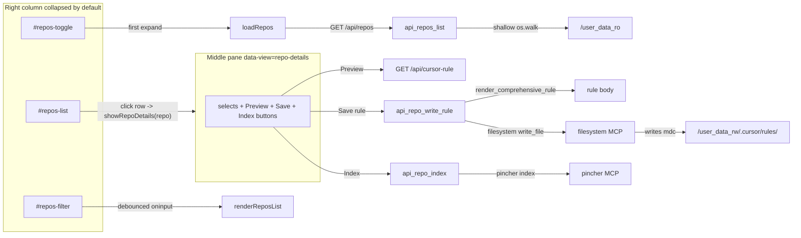

# Repositories panel

zelosMCP ships with a **Repositories** panel in the right column of the web UI (`http://localhost:8000/`) that scans the read-only mount for git repositories and lets you, in two clicks per repo:

1. **Write** a `.cursor/rules/zelosmcp.mdc` (or `.github/copilot-instructions.md`) into the repo, generated from the live tool catalog with the same dropdowns as the **Cursor rule (.mdc)** view.
2. **Index** the repo in pincher so its symbols, FTS, and graph are queryable through `pincher__*` tools.

It reuses the running `filesystem` and `pincher` backends — no new sandbox surface, no host-side write path. Every write goes through `filesystem__write_file` against `/user_data_rw/...`; every index call is a thin pass-through to `pincher__index`.

| Surface | URL |
|---|---|
| UI panel | right column of `http://localhost:8000/` (collapsed by default) |
| List endpoint | `GET /api/repos` |
| Write rule | `POST /api/repos/write-rule` |
| Index | `POST /api/repos/index` |

## How discovery works

The scanner is a shallow `os.walk` of `ZELOSMCP_REPO_SCAN_ROOT` (default `/user_data_ro`). A directory counts as a repo when it contains a `.git` entry — either a real `.git/` directory (regular clone) or a `.git` file (worktree gitdir pointer). Once a repo is found, descent into it stops so submodules and vendored repos don't double-count.

The walker prunes the following directory names so big trees stay quick:

```
.git  node_modules  .venv  venv  .tox  __pycache__
dist  build  .next   .gradle  target  .cache
```

**Special case** — when the scan root *itself* is a git repo (very common when `$HOME` is version-controlled for dotfiles), the root is **not** yielded as a single match. The walker descends into its children and surfaces real project repos at depth ≥ 1. Without this, `~/.git` would shadow every project under `~/workspace`, `~/code`, etc.

Results are cached server-side for **30 seconds**. Click the `↻` button in the panel header (or `GET /api/repos?refresh=1`) to bust the cache.



## UI walkthrough

The panel sits below the **Servers** list in the right column.

- **Collapsed by default.** Clicking the header toggle expands it and lazy-loads the scan; users who never open the panel pay zero scan cost.
- **Filter input.** Plain case-insensitive substring match against `name + path_ro`, debounced ~80 ms. The header shows `7 / 23` when filtered, just `23` otherwise.
- **Per-row pills.**
  - `rule` — filled green when `.cursor/rules/zelosmcp.mdc` already exists in the repo.
  - `pincher` — filled green when pincher's `list` reports the repo as an indexed project.
- **Persistence.** The collapse state and filter value are stored in `localStorage` under `zelosmcp:repos:expanded` and `zelosmcp:repos:filter` so the panel remembers itself between reloads.

Clicking a row swaps the **middle pane** to a dedicated repo-details view (mirrors how clicking a server row drives the server-details view) with the rule editor and the index button.

### Rule editor

Same five knobs as the existing `Cursor rule (.mdc)` view — pulled into the same component:

| Knob | Values | Notes |
|---|---|---|
| `Format` | `cursor-mdc` (default), `copilot-instructions` | Determines the write target: `<repo>/.cursor/rules/zelosmcp.mdc` vs. `<repo>/.github/copilot-instructions.md`. |
| `Tool use` | `priority` (default), `available` | `priority` adds the "prefer MCP tools over shell" directive plus the mandatory-backend playbook. `available` emits a neutral catalog. |
| `Access` | `read-only` (default), `read-write` | `read-only` forbids the agent from calling mutating tools; `read-write` allows them with confirmation for `[destructive]`. |
| `Style` | `always-apply` (default), `scoped` | Only meaningful for `cursor-mdc`. `scoped` enables the `Globs` input. |
| `Globs` | any glob (e.g. `**/*.py`) | Required when `Style=scoped`; ignored otherwise. |

`Preview` round-trips the chosen knobs through `GET /api/cursor-rule?...` so the previewed body is **byte-identical** to what `Save rule to repo` will write. `Save` then POSTs to `/api/repos/write-rule`, which re-renders with the same args and forwards a `create_directory` + `write_file` pair to the `filesystem` MCP.

### Index in pincher

`Index in pincher` POSTs `{ "path": "/user_data_ro/<repo>" }` to `/api/repos/index`, which forwards to `pincher__index`. After success the row's `pincher` pill flips to green without a full rescan. Re-indexing later is incremental — pincher uses xxh3 content hashes to skip unchanged files, so calling `Index` repeatedly is cheap.

See [docs/default-mcps.md](default-mcps.md#pincher) for what indexing actually does (symbol store + knowledge graph + FTS5).

## Endpoints

### `GET /api/repos`

Returns the discovered repo list. Query param `refresh=1` busts the 30 s cache.

```bash
curl -sS http://localhost:8000/api/repos | jq '.repos[0]'
```
```json
{
  "name": "zelosmcp",
  "path_ro": "/user_data_ro/workspace/zelosmcp",
  "path_rw": "/user_data_rw/workspace/zelosmcp",
  "has_rule": true,
  "pincher_indexed": true
}
```

`pincher_indexed` is computed by calling `pincher__list` once per request and checking whether each discovered path appears in the response. If pincher isn't running or the call errors, every `pincher_indexed` is reported as `false` (logged at INFO; the request still succeeds).

### `POST /api/repos/write-rule`

Body:

```json
{
  "path":     "/user_data_ro/workspace/myproj",
  "format":   "cursor-mdc",
  "tool_use": "priority",
  "access":   "read-only",
  "style":    "always-apply",
  "globs":    "**/*.py"
}
```

All fields except `path` are optional and default to the same values as `/api/cursor-rule`. The handler:

1. Rejects any `path` not under `ZELOSMCP_REPO_SCAN_ROOT` (HTTP 400).
2. Builds the rule body via `zelosmcp.builtin.render_comprehensive_rule` against the live catalog and `manager.mandatory_names()`.
3. Computes the write target by swapping the read-only mount prefix for the read-write one (e.g. `/user_data_ro/foo` → `/user_data_rw/foo/.cursor/rules/zelosmcp.mdc`).
4. Forwards `filesystem__create_directory` then `filesystem__write_file` to the running `filesystem` MCP backend.

Filesystem's own sandbox refuses writes outside `/user_data_rw`, so this handler trusts that gate after the single prefix check.

Returns `{ "ok": true, "path": "<absolute target>", "bytes": <int> }` on success. `503` if `filesystem` isn't running. `500` with the underlying error if filesystem rejects the write.

### `POST /api/repos/index`

Body: `{ "path": "/user_data_ro/<repo>" }`. Validates the prefix and forwards to `pincher__index` against the read-only path. Returns `{ "ok": true, "path": "<input>", "result": <pincher payload> }` on success. `503` if `pincher` isn't running. `500` if pincher errors.

## Configuration

Three environment variables tune the scanner:

| Env var | Default | Purpose |
|---|---|---|
| `ZELOSMCP_REPO_SCAN_ROOT` | `/user_data_ro` | Where the walker starts. Tests point this at `tmp_path` instead of mounting anything. |
| `ZELOSMCP_REPO_RW_ROOT` | `/user_data_rw` | Read-write twin of the scan root. The handler swaps the prefix before forwarding to filesystem. |
| `ZELOSMCP_REPO_SCAN_DEPTH` | `4` | Maximum subdirectory depth the walker descends. Layouts like `~/workspace/<group>/<repo>` work at depth 2; deeper nests like `~/code/clients/<client>/<repo>` use 3-4. |

The default scan root + read-write root pair is set up by `make up`, which bind-mounts your host's `$USER_DATA_ROOT` (default `$HOME`) twice — read-only at `/user_data_ro` and read-write at `/user_data_rw`. See [docs/makefile.md](makefile.md#mounts).

## Path-safety model

The two POST handlers accept a `path` argument from the UI and forward it to MCP backends. Three independent guards prevent arbitrary host writes:

1. **Prefix check.** `is_under_scan_root` rejects any path that doesn't normalize to a directory under `ZELOSMCP_REPO_SCAN_ROOT`. Look-alike prefixes (e.g. `/user_data_ro_evil`) are caught explicitly.
2. **Filesystem MCP sandbox.** The `@modelcontextprotocol/server-filesystem` backend refuses any read or write outside the directory it was launched with — `/user_data_rw` by default. Even if the prefix check were bypassed, filesystem would reject the call.
3. **Kernel-enforced read-only mount.** `/user_data_ro` is mounted with the `:ro` flag, so any attempt to write through it fails at the syscall level.

## Caveats

- **Scan root must be a directory.** When the configured root doesn't exist (e.g. you launched zelosMCP outside Docker without setting `ZELOSMCP_REPO_SCAN_ROOT`), `/api/repos` quietly returns an empty list rather than 500.
- **Symlinks aren't followed.** `os.walk(followlinks=False)` is the default. A symlink farm to repos elsewhere on the host won't be discovered.
- **Filter is client-side.** The 30 s server cache is shared across requests, but the filter input only affects what the user sees in the panel — the scan walks the whole tree regardless of the filter.
- **Write target is not previewed.** The Preview pane shows the rule body but not the absolute write path. The detail view's `Read-write: <path_rw>` line is the source of truth — `<path_rw>/.cursor/rules/zelosmcp.mdc` (cursor-mdc) or `<path_rw>/.github/copilot-instructions.md` (copilot-instructions).
- **Indexing is one-shot.** There's no "uninstall pincher project" or "remove rule from repo" action. Re-indexing is incremental but never destructive; deleting a project from pincher's store needs `pincher__index` with a different path or pincher's own admin tooling.

## Related

- [docs/cursor-integration.md](cursor-integration.md) — the rule generator the editor wraps.
- [docs/default-mcps.md](default-mcps.md) — what the `pincher` and `filesystem` backends do, why they're mandatory.
- [docs/built-in-mcp.md](built-in-mcp.md) — `zelosmcp__generate_cursor_rule` exposes the same rule body over MCP.
- [docs/http-api.md](http-api.md) — full REST surface, including `/api/cursor-rule` query params.
