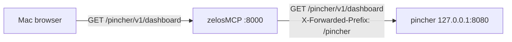

# Reverse-proxy config

Some MCP backends ship more than just an MCP server — they also expose an HTTP REST API or a web dashboard on a sidecar port. [Pincher](default-mcps.md#pincher), for example, serves a self-contained codebase-intelligence dashboard at `<host>:8080/v1/dashboard` whenever it's launched with `--http`.

Rather than punching a second hole through your container's network namespace and exposing each backend's port directly to the host, zelosMCP can **reverse-proxy** those endpoints under its own port. The pattern looks like this:



Only `:8000` is reachable from outside the container. Pincher's HTTP server stays on loopback. The browser sees the dashboard at `http://localhost:8000/pincher/v1/dashboard` exactly as if pincher were natively serving it on zelosMCP's port.

## Schema

A backend's `mcpServers.<name>` entry can include an optional `reverseProxy` block alongside the usual transport fields:

```json
"pincher": {
  "command": "pincher",
  "args": ["--data-dir", "/tmp/pincher", "--http", "127.0.0.1:8080", "--trust-proxy"],
  "reverseProxy": {
    "mount": "/pincher",
    "upstream": "http://127.0.0.1:8080"
  }
}
```

| Field | Required | Type | Default | Notes |
|---|---|---|---|---|
| `mount` | yes | string | — | URL prefix on zelosMCP. Must start with `/`, no trailing `/`, no `..`, no whitespace. Cannot collide with [reserved mounts](#reserved-mounts). |
| `upstream` | yes | string | — | Backend HTTP sidecar URL. Must be `http://` or `https://` with a host. Recommend a loopback host (`127.0.0.1`, `localhost`) — see [Network isolation](#network-isolation). |
| `stripPrefix` | no | bool | `false` | Strip `mount` from the request path before forwarding. Off by default — pincher and other prefix-aware servers prefer to see the original path plus `X-Forwarded-Prefix`. Turn on for upstreams that don't understand the header. |
| `headers` | no | object of strings | `{}` | Extra headers to inject on the forwarded request. Override the auto-injected `X-Forwarded-*` set by repeating the same key here. |
| `auth.bearer` | no | string | — | Bearer token attached as `Authorization: Bearer <value>` when the caller hasn't supplied their own. Supports `${ENV_VAR}` interpolation; missing variables fail config-parse. |

### Auto-injected headers

Every forwarded request gets these unless overridden via `headers`:

| Header | Value |
|---|---|
| `X-Forwarded-Proto` | The ASGI scope's `scheme` (`http` or `https`). |
| `X-Forwarded-Host` | The original `Host` header (e.g. `localhost:8000`). |
| `X-Forwarded-Prefix` | The configured `mount`. |
| `X-Forwarded-For` | The client IP, appended to any existing chain. |

`Host` itself is rewritten to the upstream's authority (httpx default).

Hop-by-hop headers per RFC 7230 §6.1 (`Connection`, `Keep-Alive`, `Transfer-Encoding`, `TE`, `Trailer`, `Upgrade`, `Proxy-Authenticate`, `Proxy-Authorization`) plus `Content-Length` are stripped on both request and response sides — httpx recomputes them as needed.

### Reserved mounts

The same way [`mcpServers` rejects names that collide with built-in routes](configuration.md#reserved-names), `reverseProxy.mount` rejects path prefixes that would shadow zelosMCP's own surface or the MCP dispatcher:

| Mount | Why |
|---|---|
| `/` | Would intercept every route. |
| `/api` | zelosMCP's control plane (`/api/*`). |
| `/mcp` | Aggregator endpoint. |
| `/docs`, `/redoc`, `/openapi.json` | API docs. |
| `/catalog` | Standalone catalog page. |

Two backends also can't claim **overlapping** mounts. `/foo` and `/foo/bar` are rejected at parse time because `/foo/bar/anything` would be ambiguous. `/foo` and `/foobar` are fine — they split on segment boundaries.

## Routing precedence

When zelosMCP receives a request, it checks dispatch options in this order:

1. **`/mcp`** → aggregator.
2. **`/<name>/mcp`** → that backend's MCP session.
3. **`/<mount>/...`** → the matching `reverseProxy`.
4. **Anything else** → Starlette's router (`/api/*`, `/`, `/catalog`, etc.).

`/<name>/mcp` always wins over a `reverseProxy` at the same prefix. So a backend named `pincher` with `mount: /pincher` keeps `/pincher/mcp` for the MCP session and routes `/pincher/v1/...` (and everything else) through the proxy.

## Network isolation

The whole point of reverse-proxying is so backends can stay on the container's loopback while zelosMCP gates external access on its single port. Two pieces have to line up:

1. **Bind the backend's HTTP server to `127.0.0.1:<port>`**, not `:<port>` or `0.0.0.0:<port>`.
2. **Set `upstream` to the matching loopback URL** (e.g. `http://127.0.0.1:8080`). zelosMCP, sharing the namespace, reaches it directly.

The default pincher entry in [`configs/default-zelosmcp.json`](../configs/default-zelosmcp.json) demonstrates the pattern:

```json
"pincher": {
  "command": "pincher",
  "args": ["--data-dir", "/tmp/pincher", "--http", "127.0.0.1:8080", "--trust-proxy"],
  "reverseProxy": {
    "mount": "/pincher",
    "upstream": "http://127.0.0.1:8080"
  }
}
```

`--trust-proxy` (a [pincher feature](https://github.com/kwad77/pincherMCP)) tells pincher to honour `X-Forwarded-Prefix` so its embedded dashboard JS rewrites its `/v1/...` fetch calls under the prefix automatically. With it on, zelosMCP can leave `stripPrefix: false` and forward paths verbatim.

zelosMCP runs in **bridge networking** with explicit port publishing (`docker run -p $ZELOSMCP_BIND_ADDR:8000:8000 ...`). The default `ZELOSMCP_BIND_ADDR=127.0.0.1` means only your Mac can reach `:8000`, and the container's loopback is fully isolated from the host's. Backend sidecars on `127.0.0.1:<port>` inside the container stay there; the Mac can't reach them at all. (Set `ZELOSMCP_BIND_ADDR=0.0.0.0` if you want LAN access on `:8000`.)

### How to verify

Check the actual bind from inside the container — pincher should appear once, on loopback:

```bash
docker exec zelosmcp \
  awk '$2 ~ /:1F90$/ { print }' /proc/net/tcp
# Expect: ... 0100007F:1F90 ... LISTEN
# (0100007F = 127.0.0.1 byte-reversed; 1F90 = 8080)
```

If you see `00000000:1F90` in that list, pincher is bound to all interfaces and you forgot the `127.0.0.1:` prefix in `args`.

## Worked example: pincher

The default config wires pincher's REST + dashboard at `http://localhost:8000/pincher/v1/...`. After `make up`:

| Original (direct, blocked) | Through zelosMCP |
|---|---|
| `http://localhost:8080/v1/dashboard` | `http://localhost:8000/pincher/v1/dashboard` |
| `http://localhost:8080/v1/openapi.json` | `http://localhost:8000/pincher/v1/openapi.json` |
| `POST http://localhost:8080/v1/search` | `POST http://localhost:8000/pincher/v1/search` |
| `http://localhost:8080/v1/health` | `http://localhost:8000/pincher/v1/health` |

The pincher `/<name>/mcp` route is unchanged: `http://localhost:8000/pincher/mcp` still serves pincher's MCP protocol via stdio-bridged Streamable HTTP.

## Lifecycle

The reverse-proxy registry is rebuilt on every `POST /api/start`. When a backend with a `reverseProxy` block stops (manual `POST /api/servers/<name>/stop` or whole-config swap), requests to its mount return:

```json
{ "error": "No MCP server '<name>' is running" }
```

with status 503 — the same shape `/<name>/mcp` returns when the named backend is down. Restart the backend and the route works again.

If the backend is running but its HTTP sidecar isn't reachable (wrong port, crashed sidecar, network partition), the proxy returns 502:

```json
{
  "error": "reverse-proxy upstream unreachable",
  "backend": "pincher",
  "upstream": "http://127.0.0.1:8080",
  "detail": "<httpx error message>"
}
```

## Troubleshooting

### "I can reach a backend port directly on my Mac, not just `:8000`"

Shouldn't happen with the current bridge-networking setup. If it does, you're probably still on an older container started with `--network host`. Stop and rebuild:

```bash
make down
make up
```

The Makefile's `docker run` should now include `-p 127.0.0.1:8000:8000` and **not** `--network host`. If you've customized the run line, that's the regression to look for.

### "I get 503 every time I hit `/pincher/v1/...`"

The backend isn't running. Check `GET /api/status`: the `pincher` entry should have `"running": true`. If not, look at `/api/logs` for the spawn error.

### "I get 502 with `simulated dead upstream` (or similar)"

The backend is running but its HTTP sidecar isn't listening at the configured `upstream`. Common causes:

- The backend was launched without its HTTP flag (e.g. pincher missing `--http 127.0.0.1:8080`).
- Wrong port in `upstream`.
- The backend is bound to a loopback address that's outside the zelosMCP container's namespace — under bridge networking, only ports inside the container can be reached as `127.0.0.1` from zelosMCP's reverse proxy.

### "Two backends both want `/foo` — config rejected"

Mount overlap. `parse_config` rejects `/foo` + `/foo` (exact dup) and `/foo` + `/foo/bar` (prefix overlap). Pick distinct prefixes (`/foo` and `/bar`) or sibling names (`/foo` and `/foobar`).

### "My OpenAPI client builds the wrong URL behind the proxy"

Tools that consume OpenAPI specs need the backend itself to advertise its base path, not just zelosMCP. Pincher does this via `--trust-proxy` + `X-Forwarded-*` headers, which zelosMCP injects automatically. For other backends, check whether they have an equivalent setting (Spring Boot's `server.forward-headers-strategy=framework`, FastAPI's `root_path`, etc.).

## See also

- [configuration.md](configuration.md) — the parent `mcpServers` schema.
- [default-mcps.md](default-mcps.md#pincher) — pincher's reverse-proxy entry in the default config.
- [architecture.md](architecture.md) — how reverse-proxy fits into zelosMCP's overall dispatch.
